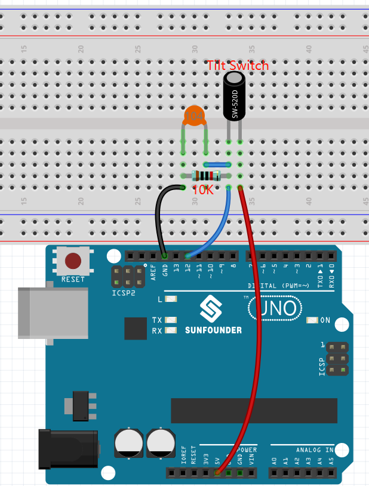
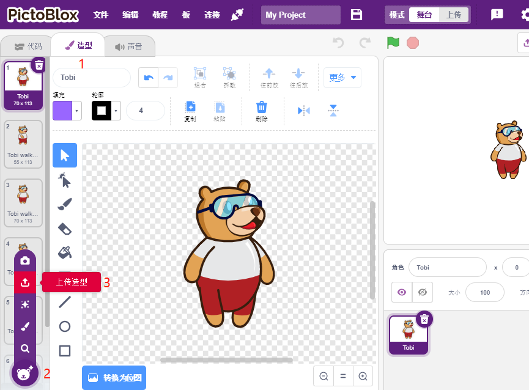
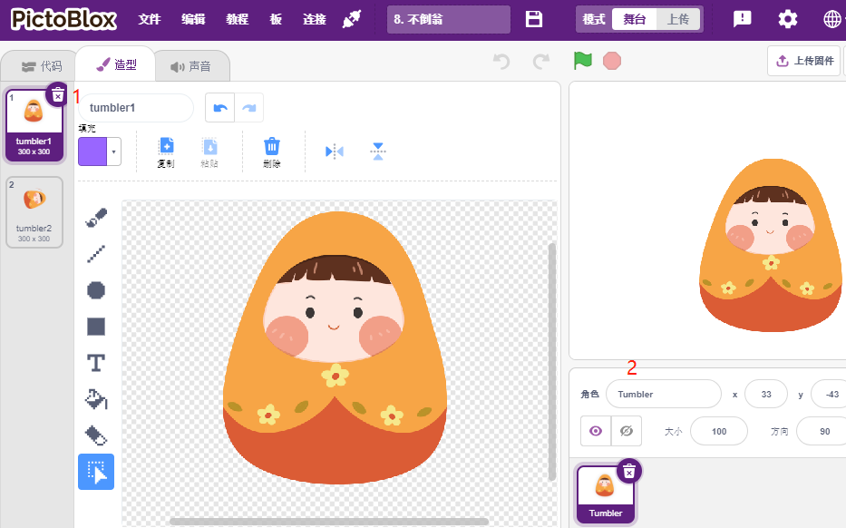
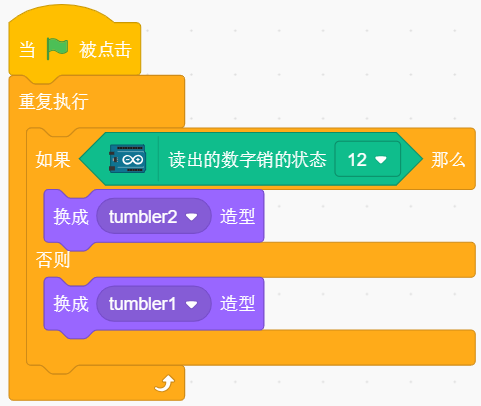

8. 不倒翁
=============

现在我们用一个倾斜开关控制舞台上的不倒翁，让开关倾斜，不倒翁也倾斜。

.. image:: img/8_tumbler.png

You Will Learn
---------------------

- 倾斜开关工作原理
- [如果（）那么（）否则（）]块
- 添加外部精灵

搭建电路
-----------------------

这里使用的倾斜开关是一个里面有金属球的器件。直立时，2个引脚连在一起，倾斜时，它们是分开的。

根据下图搭建电路：

* 将倾斜开关的一个引脚连接到引脚12，该引脚连接下拉电阻和0.1uF（104）电容（用于在倾斜开关工作时消除抖动并输出稳定电平）。
* 将电阻和电容的另一端连接到 GND，将倾斜开关的另一个引脚连接到 5V。

* :ref:`面包板`
* :ref:`倾斜开关`
* :ref:`电阻`
* :ref:`电容`

编程
------------------

**1. 自定义精灵**

选中Tobi精灵，进入到造型页面中。选中左下角的图标，然后选择 **上传造型**。

同时选中 ``SunFounder Uno R3学习套件\Scratch项目代码\图片`` 路径中的 ``tumbler1.png`` and ``tumbler2.png``, 请确保你已经参考 :ref:`下载资料` 下载了相关资料。

.. image:: img/8_add_tumbler.png

删除Tobi精灵相关的造型，并将名字改为 **Tumbler**。现在我们已经定制了一个新的精灵Tumbler， 现在开始为它编写脚本。

**2. 让开关倾斜**

如果读到pin12的值为0，即开关是倾斜的，则将精灵造型切换为tumbler2, 也是处于倾斜状态。否则，切换精灵造型为tumbler1, 直立状态。

* [如果（）那么（）否则（）]：如果条件为真，则第一个 C（空格）内的代码将被激活；如果条件为假，则第二个 C 中的代码将激活。
* [=]: 比较运算符, 用来对比等号2边的值是否相等，来自运算调色板.

