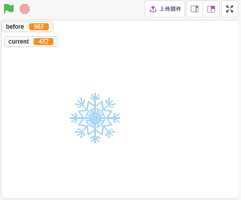
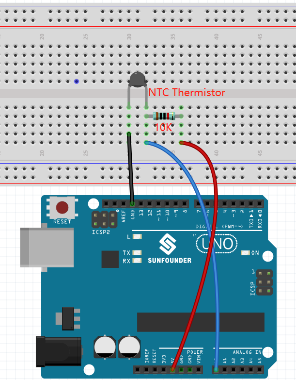
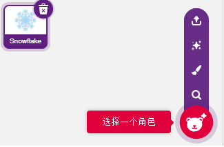
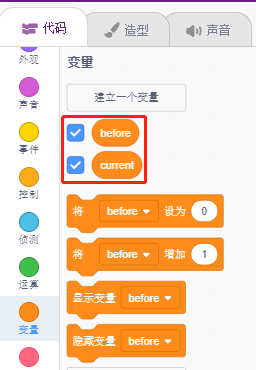
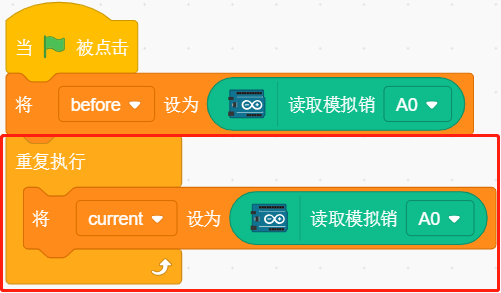
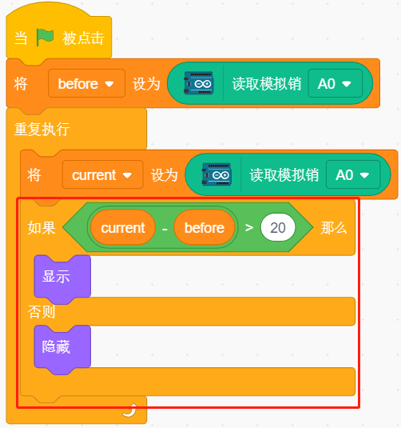

9. 低温报警器
=========================

在这个项目中，我们将制作低温报警系统，当温度超过一定时候，舞台上的就会出现雪花标志。

你将学习
---------------------

- 了解热敏电阻
- 多变量及减法运算

搭建电路
-----------------------

热敏电阻是一种电阻强烈依赖于温度的电阻器，比标准电阻器的电阻更大，并且有两种类型的电阻器，PTC（电阻随温度升高而增加）和 PTC（电阻随温度升高而降低）。

根据下图搭建电路：

热敏电阻一端接GND，另一端接A0，串联一个10K电阻到5V。

这里使用的是NTC热敏电阻，所以当温度升高时，热​​敏电阻的阻值减小，A0的分压减小，从A0得到的值减小，反之增大。

* :ref:`面包板`
* :ref:`热敏电阻` 
* :ref:`电阻`

编程
------------------

**1. 选择精灵**

删除默认精灵，点击精灵区域右下角的 **选择一个角色** 按钮，在搜索框中输入 **Snowflake**，然后点击添加。

**2. 创建2个变量**

创建2个变量， **before** 和 **current**，用来存放程序运行一开始A0（热敏电阻）的值以及当前的值。

**3. 读取A0的值**

当绿色旗子点击时，读取A0的值并存放到变量 **before**。

**4. 再次读取A0的值**

在[重复执行]中，再次读取A0的值存放到变量 **current**。

**5.判断温度变化**

使用[如果（）那么（） 否则（）] 块, 判断当前的A0值是否比之前大50，即温度降低了。此时让Snowflake精灵显示，否则隐藏.

* [如果（）那么（） 否则（）]：条件判断块来自 **控制** 调色板。判断 **如果** 的条件是否满足，如果满足，运行里面的块; 否则运行 **否则** 内的块.
* [-] & [>]: 减法运算符和比较运算符，来自 **运算** 调色板。
* [显示] & [隐藏]：显示和隐藏精灵。

