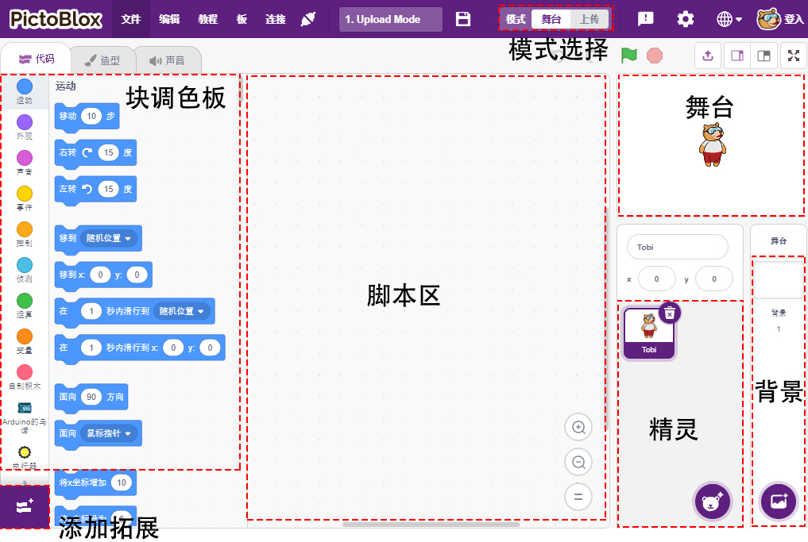

界面介绍
===============

**精灵**

精灵是在项目中执行不同操作的对象或角色，它理解并服从给予它的命令。每个精灵都有特定的造型和声音，你也可以自定义。

**舞台**

舞台是精灵根据你的程序在背景中执行动作的区域。

**背景**

背景是用来装饰舞台的。你可以从 PictoBlox 中选择背景、自己画一个或从你的计算机上传图像。

**脚本区**

脚本是 PictoBlox/Scratch 术语中的程序或代码。它是一组按特定顺序排列的“块”，用于执行一个任务或一系列任务。你可以编写多个脚本，所有脚本都可以同时运行。你只能在屏幕中央的脚本区编写脚本。

**块**

块就像拼图的碎片，用于通过简单地将它们堆叠在脚本区域中来编写程序。使用块来编写代码可以使编程更容易并降低出错的概率。

**块调色板**

块调色板位于左侧区域，并以其功能命名，例如运动、声音和控制。每个调色板都有不同的块，例如， **运动** 调色板中的块将控制精灵的移动，而 **控制** 调色板中的块将根据特定条件控制脚本的工作。

还有其他类型的块调色板可以从位于左下角的添加扩展按钮加载。

**模式**

与 Scratch 不同，PictoBlox 有两种模式：

* :ref:`舞台模式`: 在此模式下，你可以为精灵和板编写脚本以与精灵实时交互。如果你断开电路板与 Pictoblox 的连接，你将无法再进行交互。
* :ref:`上传模式`: 此模式允许你编写脚本并将其上传到开发板，以便你在未连接计算机的情况下也可以使用，例如你需要上传脚本来制作移动机器人。

更多的信息请参考：https://thestempedia.com/tutorials/getting-started-pictoblox
