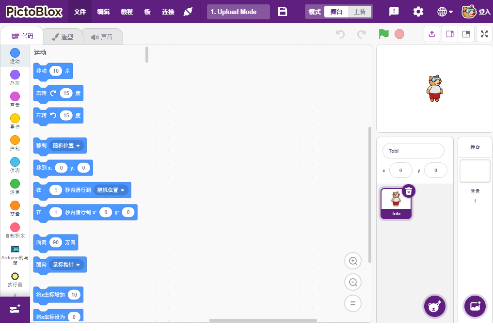

Play with Scratch
========================

Besides programming on the Arduino IDE with Uno/Mega2560 boards, we can also use them for graphical programming.

Here we recommend programming with Scratch, but the official Scratch is currently only compatible with Raspberry Pi, so we have partnered with a company, STEMPedia, who has developed a Scratch 3 based graphical programming software for Arduino boards (Uno, Mega2560 and Nano) - `PictoBlox <https://thestempedia.com/product/pictoblox/>`_.

It keeps the basic functions of Scratch 3, but also adds control boards, such as Arduino Uno, Mega, Nano, ESP32, Microbit and STEAMPedia homemade main boards, which can use external sensors, robots to control the sprites on the stage, with strong hardware interaction capabilities.

In addition, it has AI and machine learning, even if you do not have much programming foundation, you can learn and use these popular and high-tech.

Just drag and drop the Scratch coding blocks and make cool games, animations, interactive projects, and even control robots the way you want!

Now let's start the journey of discovery!

.. toctree::
    :maxdepth: 1
    
    install_and_introduce
    projects
    

    

    

