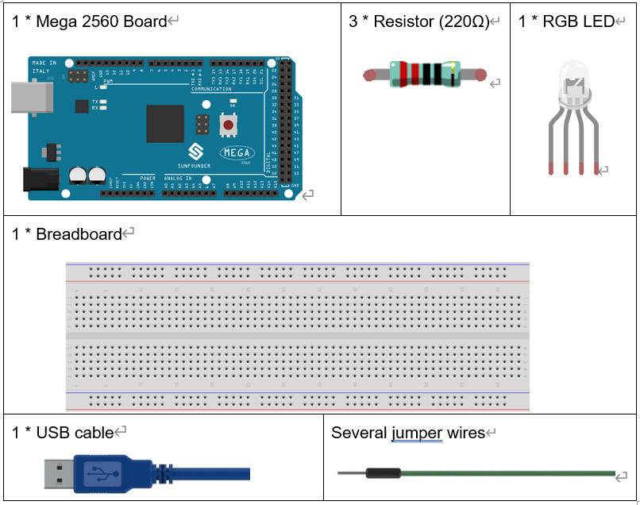
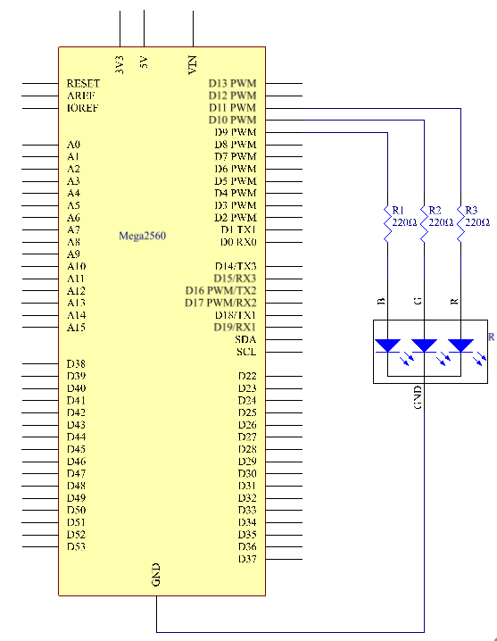
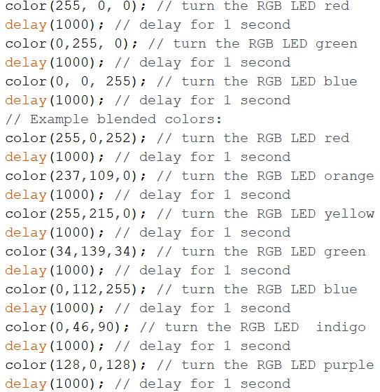
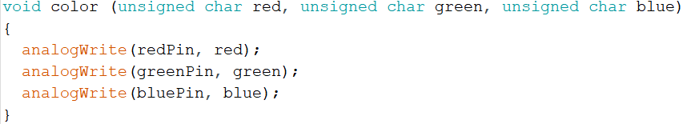

RGB LED
============

Introduction
----------------

Previously we've used the digital pin to control an LED brighten and
dim. In this lesson, we will use PWM to control an RGB LED to flash
various kinds of color. When different PWM values are set to the R, G,
and B pins of the LED, its brightness will be different. When the three
different colors are mixed, we can see that the RGB LED flashes
different colors.

Components
-------------------

Experimental Principle
-----------------------------

PWM
^^^^^^^^^^^^

Pulse width modulation, or PWM, is a technique for getting analog
results with digital means. Digital control is used to create a square
wave, a signal switched between on and off. This on-off pattern can
simulate voltages in between full on (5 Volts) and off (0 Volts) by
changing the portion of the time the signal spends on versus the time
that the signal spends off. The duration of "on time" is called pulse
width. To get varying analog values, you change, or modulate, that
width. If you repeat this on-off pattern fast enough with some device,
an LED for example, it would be like this: the signal is a steady
voltage between 0 and 5V controlling the brightness of the LED. (See the
PWM description on the official website of Arduino).

In the graphic below, the green lines represent a regular time period.
This duration or period is the inverse of the PWM frequency. In other
words, with Arduino's PWM frequency at about 500Hz, the green lines
would measure 2 milliseconds each.

.. image:: media_mega2560/image110.jpeg
    :align: center

A call to analogWrite() is on a scale of 0 - 255, such that
analogWrite(255) requests a 100% duty cycle (always on), and
analogWrite(127) is a 50% duty cycle (on half the time) for example.

You will find that the smaller the PWM value is, the smaller the value
will be after being converted into voltage. Then the LED becomes dimmer
accordingly. Therefore, we can control the brightness of the LED by
controlling the PWM value.

RGB LED
^^^^^^^^^^^^

RGB LEDs emit light in various colors. An RGB LED packages three LEDs of
red, green, and blue into a transparent or semitransparent plastic
shell. It can display various colors by changing the input voltage of
the three pins and superimpose them, which, according to statistics, can
create 16,777,216 different colors.

.. image:: media_mega2560/image111.jpeg
    :align: center

RGB LEDs can be categorized into common anode and common cathode ones.
In this experiment, the latter is used. The common cathode, or CC, means
to connect the cathodes of the three LEDs. After you connect it with GND
and plug in the three pins, the LED will flash the corresponding color.

An RGB LED has 4 pins: the longest one is GND; the others are Red, Green
and Blue. Touch its plastic shell and you will find a cut. The pin
closest to the cut is the first pin, marked as Red, then GND, Green and
Blue in turn.

.. image:: media_mega2560/image114.png
    :align: center

Or you can distinguish them in another way. As GND is the longest one
and can be defined directly, you just need to confirm the other three
pins. You can test it by giving them a small voltage. The forward
voltage drop from the three pins to the GND are respectively 1.8V (red),
2.5V (blue), and 2.3V (green). Thus, when you connect the same current
limiting resistor with the three pins and supply them with the same
voltage, the red one is the brightest, and then comes the green and the
blue one. Therefore, you may need to add a current limiting resistor
with different resistances to the three pins for these colors.

Principle:
^^^^^^^^^^^^^^^^^^^

On the Mega2560 board, 2 to 13 and 44 to 46. Provide 8-bit PWM output
with
the `analogWrite() <https://www.arduino.cc/en/Reference/AnalogWrite>`__ function.
You can connect any of these pins.Here we input a value between 0 and
255 to the three pins of the RGB LED to make it display different
colors. After connecting the pins of R, G, and B to a current limiting
resistor, connect them to the pin 9, pin 10, and pin 11 respectively.
The longest pin (GND) of the LED connects to the GND of the Mega 2560.
When the three pins are given different PWM values, the RGB LED will
display different colors.

The schematic diagram:

Experimental Procedures
----------------------------------

**Step 1:** Build the circuit

.. image:: media_mega2560/image116.png
    :align: center

**Step 2:** Open the code file.

**Step 3:** Select the **Board** and **Port.**

**Step 4:** Upload the sketch to the board.

Here you should see the RGB LED flash circularly red, green, and blue
first, then red, orange, yellow, green, blue, indigo, and purple.

.. image:: media_mega2560/image117.jpeg

Code
--------

.. raw:: html

    <iframe src=https://create.arduino.cc/editor/sunfounder01/776a7e95-83f8-471c-ac0a-2752e4341ce3/preview?embed style="height:510px;width:100%;margin:10px 0" frameborder=0></iframe>

Code Analysis
^^^^^^^^^^^^^^^^^^

**Code Analysis** **9-1** **Set the color**

Here use the *color()* function to set the color of the RGB LED. In the
code, it is set to flash 7 different colors.

You can use the paint tool on your computer to get the RGB value.

1) Open the paint tool on your computer and click to Edit colors.

2) Select one color, then you can see the RGB value of this color. Fill
   them in the code.

.. image:: media_mega2560/image119.png

**Code Analysis** **9-2** **color()function**

Define three unsigned char variables, i.e., red, green and blue. Write
their values to *redPin*, *greenPin* and *bluePin*. For example,
color(128,0,128) is to write 128 to *redPin*, 0 to *greenPin* and 128 to
*bluePin*. Then the result is the LED flashing purple.

**analogWrite()**: Writes an analog value (PWM wave) to a pin. It has
nothing to do with an analog pin, but is just for PWM pins. You do not
need to call the *pinMode()* to set the pin as output before calling
*analogWrite()*.