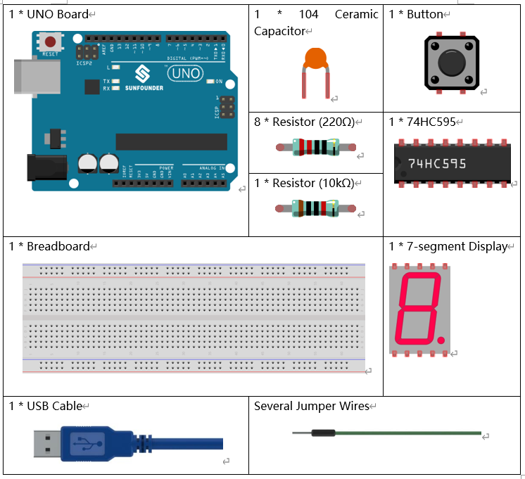
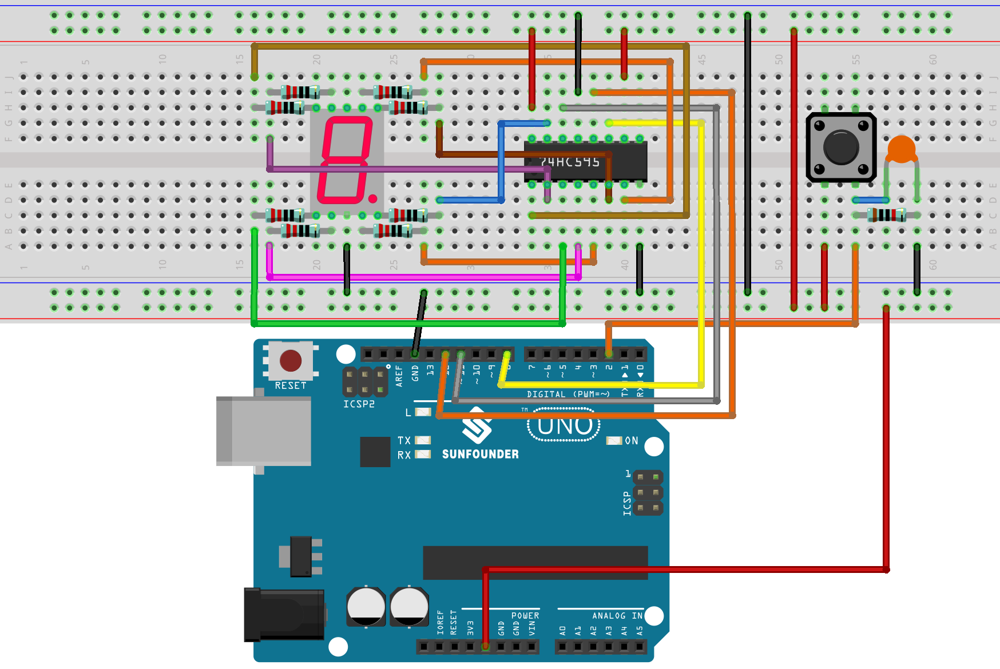
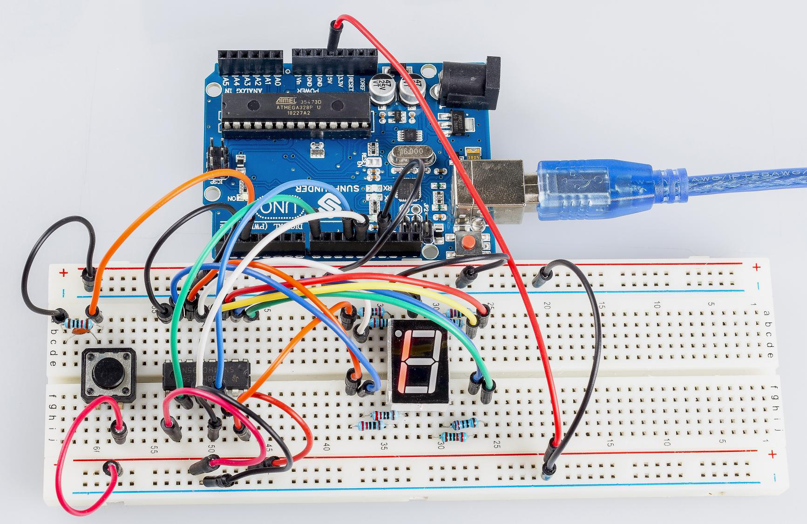

Simple Creation - Digital Dice Uno
==================================================

Introduction
------------------

In previous experiments, we learned how to use a 7-segment display and
control LEDs by a button. In this lesson, we will use a 7-segment
display and a button together to create a simple digital dice.

Components
-------------

Schematic Diagram
---------------------

The idea behind a digital dice is very simple: a 7-segment display
circularly jumps from 1 to 7 rapidly. When the button is pressed, the
jumping will slow down until it stops on a number. When the button is
pressed again, the process will repeat.

.. image:: media_uno/image195.png
   :alt: C:\Users\sunfounder\Desktop\ytryh.png
   :width: 7.02847in
   :height: 3.86806in
   :align: center

Experimental Procedures
---------------------------

**Step 1:** Build the circuit.

**Step 2:** Open the code file.

**Step 3:** Select the Board and Port.

**Step 4:** Upload the sketch to the board.

You can now see the 7-segment display jump between numbers from 1 to 6.
Press the button, and the jumping will slow down until it stops three
seconds later. Press the button again, and the process will repeat.

Code
--------

.. raw:: html

    <iframe src=https://create.arduino.cc/editor/sunfounder01/03087a2a-e729-42d0-ac76-6754728a6ca0/preview?embed style="height:510px;width:100%;margin:10px 0" frameborder=0></iframe>

Code Analysis
----------------

**Code Analysis** **25-1** **The initial random number comes from A0**

.. code-block:: arduino

    randomSeed(analogRead(0));

The initial random number is generated from A0 and the range for the
random numbers is 0-1023.

**Code Analysis** **25-2** **Digital Dice**

.. code-block:: arduino 

    void loop()

    {

        int stat = digitalRead(keyIn); //store value read from keyIn

        if(stat == HIGH) // check if the pushbutton is pressed, If yes, the
        corresponding pin is high level

        {

            num ++; //*num* adds 1

            if(num > 1) //If *num* > 1, clear the value. This is to prevent repeated
            pressing. So just count it as once no matter how many times you press.

            {

                num = 0;

            }

        }

        Serial.println(num); // print the num on serial monitor

        if(num == 1) //when pushbutton is pressed

        {

            randNumber = random(1,7); //Generate a random number in 1-7

            showNum(randNumber); //show the randNumber on 7-segment

            delay(1000); //wait for 1 second

            while(!digitalRead(keyIn)); //When not press button,program stop here
            Make it keep displaying the last random number.

            int stat = digitalRead(keyIn);

            if(stat == HIGH) // check if the pushbutton is pressed

            {

                num ++;

                digitalWrite(ledPin,HIGH); //turn on the led

                delay(100);

                digitalWrite(ledPin,LOW); //turn off the led

                delay(100);

                if(num >= 1)

                {

                    num = 0;

                }

            }

        }

        //show random numbers at 100 microseconds intervals

        // If the button has not been pressed

        randNumber = random(1,7);

        showNum(randNumber);

        delay(100);

    }

**Code Analysis** **25-3** **showNum() function**

.. code-block:: arduino

    void showNum(int num)

    {

        digitalWrite(latchPin,LOW); //ground latchPin and hold low for
        transmitting

        shiftOut(dataPin,clockPin,MSBFIRST,datArray[num]);

        //return the latch pin high to signal chip that it

        //no longer needs to listen for information

        digitalWrite(latchPin,HIGH); //pull the latchPin to save the data

    }

This function is to display the number in *dataArray[]* on the 7-segment
display.

