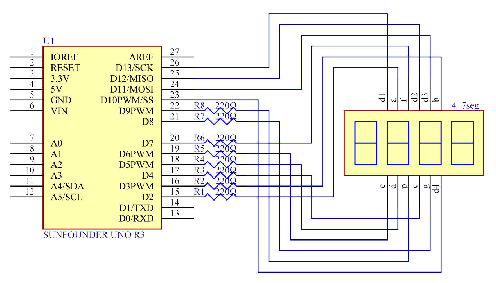

Lesson 22 Simple Creation-Stopwatch Uno
========================================

Introduction
---------------------

In this lesson, we will use a 4-digit 7-segment display to make a
stopwatch.

Components
-----------------

.. image:: media_uno/uno24.png
    :align: center

Components Introduction
---------------------------------

When a 7-segment display is used, if it is a common anode display,
connect the anode pin to power source; if it is a common cathode one,
connect the cathode pin to GND. When a 4-digit 7-segment display is
used, the common anode or common cathode pin is to control the digit
displayed. There is only one digit working. However, based on the
principle of Persistence of Vision, we can see four 7-segment displays
all displaying numbers. This is because the electronic scanning speed is
too fast for us to notice interval.

The schematic diagram of the 4-digit 7-segment display is as shown
below:

.. image:: media_uno/image176.png
   :width: 3.25972in
   :height: 2.87986in
   :align: center

Schematic Diagram
-------------------------

Experimental Procedures
-----------------------------------

**Step 1:** Build the circuit.

========================= =========
4-Digit 7-Segment Display Uno Board
a                         2
b                         3
c                         4
d                         5
e                         6
f                         7
g                         8
p                         9
D1                        13
D2                        12
D3                        11
D4                        10
========================= =========

.. image:: media_uno/image178.png

   

**Step 2:** Open the code file.

**Step 3:** Select the **Board** and **Port.**

**Step 4:** Upload the sketch to the board.

Now, you can see the number increases by one per second on the 4-digit
7-segment display.

.. image:: media_uno/image179.jpeg
   :alt: 19
   :width: 6.47292in
   :height: 4.69375in
   :align: center

Code
--------

.. raw:: html

    <iframe src=https://create.arduino.cc/editor/sunfounder01/f3d5a253-7941-40f1-a475-5a90871f06dc/preview?embed style="height:510px;width:100%;margin:10px 0" frameborder=0></iframe>

Code Analysis
-------------------

That's all for the code. It is long enough, so let me sum it up.

Setup: Set all the pins of the LED display as output. Set Timer1 as 0.1
second. Run the following functions. So add() will be called when it's
0.1 second; but before 0.1 second passes, add() is not called yet. Then
use a loop() function. The 4 LEDs are displayed as 0000. Wait for a
while. 0.1 second later, indicating count=10, call the function add().
then n++=1; because 1<10000, it will not restore to 0. Run loop() and
the LEDs will be displayed as 0001. 0.1 second later, n increases by 1,
n++=2, and the display will become 0002, and then 0003, and on and on,
till 9999. n increases by 1 every second, and the number displayed
increases accordingly, until n=10000 and n is 0 again. Then the counting
starts from 0.

**Code Analysis** **22-1** **Initialize the timer**

Timer1.initialize(100000); // set a timer of length 100000 microseconds
(or 0.1 sec - or 10Hz => the led will blink 5 times, 5 cycles of
on-and-off, per second)

.. code-block:: arduino

    Timer1.attachInterrupt( add ); // attach the service routine here

The sentence attachInterrupt(ISR) is to attach an ISR function to call
when there is an interrupt. ISR stands for interrupt service routine.
Here we use an add routine.

**Code Analysis** **22-2** **Loop function**

.. code-block:: arduino

    void loop()

    {

        clearLEDs();//clear the 7-segment display screen

        pickDigit(0);//Light up 7-segment display d1

        pickNumber((n/1000));// get the value of thousand

        delay(del);//delay 5ms

        clearLEDs();//clear the 7-segment display screen

        pickDigit(1);//Light up 7-segment display d2

        pickNumber((n%1000)/100);// get the value of hundred

        delay(del);//delay 5ms

        clearLEDs();//clear the 7-segment display screen

        pickDigit(2);//Light up 7-segment display d3

        pickNumber(n%100/10);//get the value of ten

        delay(del);//delay 5ms

        clearLEDs();//clear the 7-segment display screen

        pickDigit(3);//Light up 7-segment display d4

        pickNumber(n%10);//Get the value of single digit

        delay(del);//delay 5ms

    }

The loop function is used to let four segment display to display the
single digit, ten, one hundred and thousand of a value.

Such as n=1345, (1345/1000)=1, (1345%1000)/100)=3, ((1345%100)/10)=4, (n%10)=5.

**Code Analysis** **22-3** **pickDigit(int x) function**

.. code-block:: arduino

    void pickDigit(int x) //light up a 7-segment display

    {

        //The 7-segment LED display is a common-cathode one. So also use
        digitalWrite to set d1 as high and the LED will go out

        digitalWrite(d1, HIGH);

        digitalWrite(d2, HIGH);

        digitalWrite(d3, HIGH);

        digitalWrite(d4, HIGH);

        switch(x)

        {

        case 0:

            digitalWrite(d1, LOW);//Light d1 up

            break;

        case 1:

            digitalWrite(d2, LOW); //Light d2 up

            break;

        case 2:

            digitalWrite(d3, LOW); //Light d3 up

            break;

        default:

            digitalWrite(d4, LOW); //Light d4 up

            break;

        }

    }

The 4 digital 7 segment is a common cathode one, set all the d1,d2,d3,d4
to HIGH to let them go out.

If x is equals to 0, then run case0 let d1 to LOW level to light first 7
segment up.

**switch...case:** Like if statements, switch case controls the flow of
programs by allowing programmers to specify different code that should
be executed in various conditions. In particular, a switch statement
compares the value of a variable to the values specified in case
statements. When a case statement is found whose value matches that of
the variable, the code in that case statement is run.

The break keyword exits the switch statement, and is typically used at
the end of each case. Without a break statement, the switch statement
will continue executing the following expressions ("falling-through")
until a break, or the end of the switch statement is reached.

**Code Analysis 22-4 pickNumber(int x) function**

.. code-block:: arduino

    switch(x)

    {

    default:

        zero();

        break;

    case 1:

        one();

        break;

    case 2:

        two();

        break;

    case 3:

        three();

        .......

The function is to control the LED to display numbers. Call zero(),
one() until the nine() function to display 0-9 numbers.

Use zero() as an example:

The function void zero is to control the high/low level of LED. Use
digitalWrite to set a to f as high, g as low. Based on the pin diagram
just mentioned, when a to f is high and g is low, the number 0 will be
displayed.

.. code-block:: arduino

    void zero() //the 7-segment led display 0

    {

        digitalWrite(a, HIGH);

        digitalWrite(b, HIGH);

        digitalWrite(c, HIGH);

        digitalWrite(d, HIGH);

        digitalWrite(e, HIGH);

        digitalWrite(f, HIGH);

        digitalWrite(g, LOW);

    }

**Code Analysis 23-5 clearLEDs() function**

.. code-block:: arduino

    void clearLEDs() //clear the 7-segment display screen

    {

        digitalWrite(a, LOW);

        digitalWrite(b, LOW);

        digitalWrite(c, LOW);

        digitalWrite(d, LOW);

        digitalWrite(e, LOW);

        digitalWrite(f, LOW);

        digitalWrite(g, LOW);

    }

Write all pins a-p to LOW level, let the 7-segment digital display go
out.

**Code Analysis 22-6 add() function**

.. code-block:: arduino

    void add()

    {

        // Toggle LED

        count ++; 
        /* The original value of count is 0. count++=1; 
        keep the counting till 10, because one LED can display a maximum of 9.*/

        if(count == 10) 
        // If count=10, which is 1 second, the following statement will be run.

        {

            count = 0; //which means count from 0

            n ++; //then n++=1

            if(n == 10000) //When n=10000,

            {

                n = 0; //n restores to 0.

            }

        }

    }