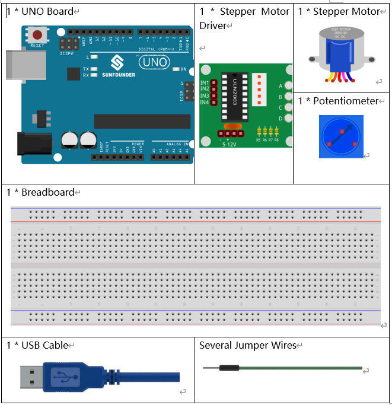
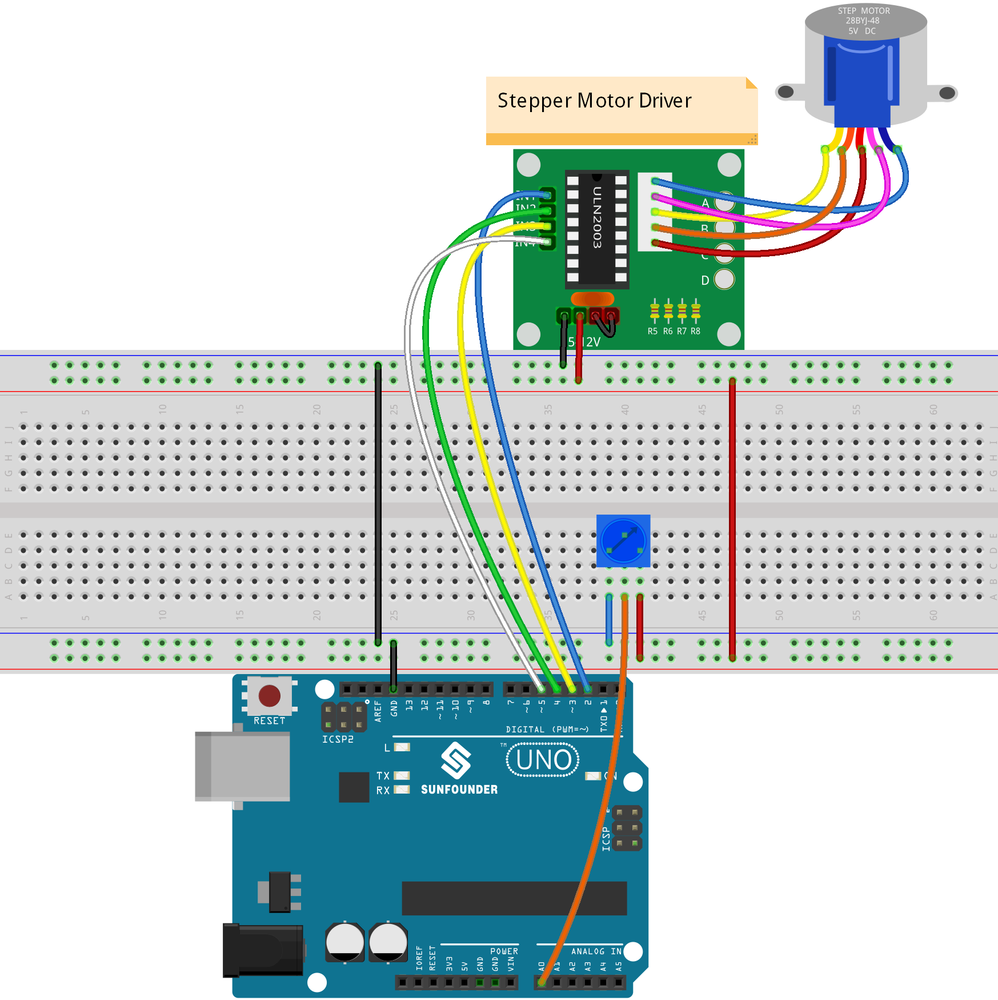
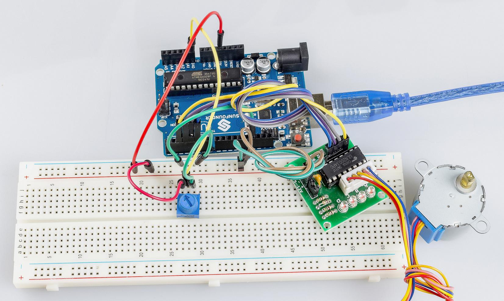

Lesson 21 Stepper Motor Uno
============================

Introduction
------------------

Stepper motors, due to their unique design, can be controlled to a high
degree of accuracy without any feedback mechanisms. The shaft of a
stepper, mounted with a series of magnets, is controlled by a series of
electromagnetic coils that are charged positively and negatively in a
specific sequence, precisely moving it forward or backward in small
"steps".

Components
-------------

Components Introduction
--------------------------------

There are two types of steppers, unipolars and bipolars, and it is very
important to know which type you are working with. In this experiment,
we will use a unipolar stepper.

The stepper motor is a four-phase one, which uses a unipolarity DC power
supply. As long as you electrify all phase windings of the motor by an
appropriate timing sequence, you can make it rotate step by step. The
schematic diagram of a four-phase reactive stepper motor:

.. image:: media_uno/image169.png
   :width: 2.61458in
   :height: 2.21875in
   :align: center

In the figure, in the middle of the motor is a rotor - a gear-shaped
permanent magnet. Around the rotor, 0 to 5 are teeth. Then more outside,
there are 8 magnetic poles, with each two opposite ones connected by
coil winding. So they form four pairs from A to D, which is called a
phase. It has four lead wires to be connected with switches SA, SB, SC,
and SD. Therefore, the four phases are in parallel in the circuit, and
the two magnetic poles in one phase are in series.

Here's how a 4-phase stepper motor works
^^^^^^^^^^^^^^^^^^^^^^^^^^^^^^^^^^^^^^^^^^^^^^^^

When switch SB is power on, switch SA, SC, and SD is power off, and
B-phase magnetic poles align with tooth 0 and 3 of the rotor. At the
same time, tooth 1 and 4 generate staggered teeth with C- and D-phase
poles. Tooth 2 and 5 generate staggered teeth with D- and A-phase poles.
When switch SC is power on, switch SB, SA, and SD is power off, the
rotor rotates under magnetic field of C-phase winding and that between
tooth 1 and 4. Then tooth 1 and 4 align with the magnetic poles of
C-phase winding. While tooth 0 and 3 generate staggered teeth with A-
and B-phase poles, and tooth 2 and 5 generate staggered teeth with the
magnetic poles of A- and D-phase poles. The similar situation goes on
and on. Energize the A, B, C and D phases in turn, and the rotor will
rotate in the order of A, B, C and D.

.. image:: media_uno/image170.png
   :width: 4.70833in
   :height: 3.3125in
   :align: center

The four-phase stepper motor has three operating modes: single
four-step, double four-step, and eight-step. The step angle for the
single four-step and double four-step are the same, but the driving
torque for the single four-step is smaller. The step angle of the
eight-step is half that of the single four-step and double four-step.
Thus, the eight-step operating mode can keep high driving torque and
improve control accuracy.

The stator of Stepper Motor we use has 32 magnetic poles, so a circle
needs 32 steps. The output shaft of the Stepper Motor is connected with
a reduction gear set, and the reduction ratio is 1/64. So the final
output shaft rotates a circle requiring a 32*64=2048 step.

ULN2003
^^^^^^^^^^^

To apply the motor in the circuit, a driver board needs to be used.
Stepper Motor Driver-ULN2003 is a 7-channel inverter circuit. .That is,
when the input pin is at high level, the output pin of ULN2003 is at low
level, and vice versa. If we supply high level to IN1, and low level to
IN2, IN3 and IN4, then the output end OUT1 is at low level, and all the
other output ends are at high level.

 The internal structure of the chip is shown as below.

.. image:: media_uno/image171.png
   :width: 4.30625in
   :height: 4.60486in
   :align: center

The stepper motor driver constituted by ULN2003 chip and 4 LEDs is shown
as follows. On the board, IN1,IN2,IN3 and IN4 work as input and the four
LEDs, A, B, C, D are the indicators of input pin. In addition,
OUT1,OUT2, OUT3 and OUT4 are connected to SA, SB, SC and SD on the
stepper motor driver. When the value of IN1 is set to a high level, A
lights up; switch SA is power on, and the stepper motor rotates one
step. The similar case repeats on and on. Therefore, just give the
stepper motor a specific timing sequence, it will rotate step by step.
The ULN2003 here is used to provide particular timing sequences for the
stepper motor.

Schematic Diagram
---------------------

.. image:: media_uno/image172.png

Experimental Procedures
---------------------------

**Step 1:** Build the circuit

The wiring between Stepper Motor Driver board and Uno board:

==================== ===
Stepper Motor Driver Uno
IN1                  2
IN2                  4
IN3                  3
IN4                  5
GND                  GND
VCC                  5v
==================== ===

**Step 2:** Open the code file.

**Step 3:** Select the **Board** and **Port.**

**Step 4:** Upload the sketch to the board.

Now, You can see the rotating shaft of the stepping motor rotating with
the turning of the knob of the potentiometer.

Code
--------

.. raw:: html

   <iframe src=https://create.arduino.cc/editor/sunfounder01/2e8012d2-0d5d-4b38-b63e-f0b792ed10b1/preview?embed style="height:510px;width:100%;margin:10px 0" frameborder=0></iframe>

Code Analysis
-----------------

**Code Analysis** **21-1** **Initialize the stepper**

.. code-block:: arduino

    #include <Stepper.h> //include a head file

    //the steps of a circle

    #define STEPS 100

    //set steps and the connection with MCU

    Stepper stepper(STEPS, 2, 3, 4, 5);

    //available to store previous value

    int previous = 0;

Include a head file Stepper.h, set the steps to 100 and then initialize
the stepper with a function stepper().

**Stepper(steps, pin1, pin2, pin3, pin4):** This function creates a new
instance of the Stepper class that represents a particular stepper motor
attached to your Arduino board.

**steps:** The number of steps in one revolution of your motor. If your
motor gives the number of degrees per step, divide that number into 360
to get the number of steps (e.g. 360 / 3.6 gives 100 steps). (*int*).

**Code Analysis** **21-2** **setSpeed() function**

.. code-block:: arduino

    //speed of 180 per minute

    stepper.setSpeed(180); //set the motor speed in rotations per minute(RPMs)

**setSpeed(rpms):** Sets the motor speed in rotations per minute (RPMs).
This function doesn't make the motor turn, just sets the speed at which
it will when you call step().

**rpms**: the speed at which the motor should turn in rotations per
minute - a positive number (long)

**Code Analysis 21-3** **setSpeed() function**

.. code-block:: arduino

    void loop()
    {
      //get analog value

      int val = analogRead(0); //Read the value of the potentiometer

      //current reading minus the reading of history

      stepper.step(val - previous); //Turn the motor in val-previous steps

      //store as prevous value

      previous = val; //the value of potentiometer assignment to variable previous
    }

**step(steps):** Turns the motor a specific number of steps, at a speed
determined by the most recent call to setSpeed(). This function is
blocking; that is, it will wait until the motor has finished moving to
pass control to the next line in your sketch. For example, if you set
the speed to, say, 1 RPM and called step(100) on a 100-step motor, this
function would take a full minute to run. For better control, keep the
speed high and only go a few steps with each call to step().

**steps:** the number of steps to turn the motor - positive to turn one
direction, negative to turn the other (int).
