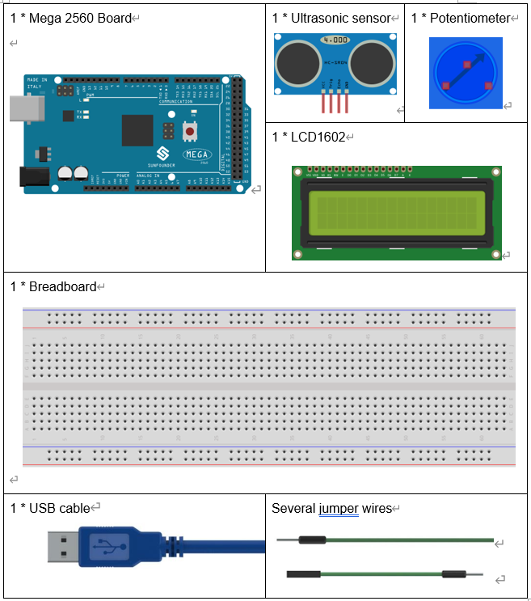
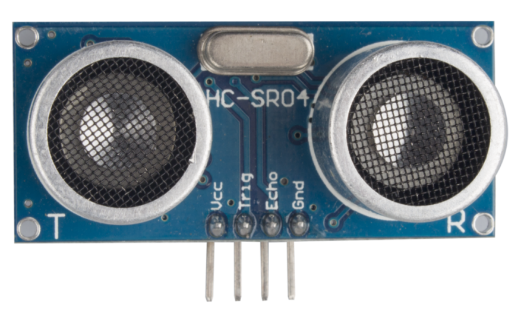

Ultrasonic
===============

Introduction
----------------

When you are reversing, you will see the distance between the car and
the surrounding obstacles to avoid collision. The device for detecting
the distance is an ultrasonic sensor. In this experiment, you will learn
how the ultrasonic wave detects the distance.

Components
-------------

Experimental Principle
--------------------------

The ultrasonic distance sensor is really useful and widely applicable in
our daily life. It has two probes. One is to send ultrasonic waves and
the other is to receive the waves and transform the time of sending and
receiving into a distance, thus detecting the distance between the
device and an obstacle. In practice it is really convenient and
functional.

The ultrasonic ranging module HC-SR04 provides 2cm-700cm non-contact
measurement function, and the ranging accuracy can reach 3mm. Stable
signal can be ensured within 5m, and signal gradually fades beyond 5m
till disappearing at 7m position.

The module includes ultrasonic transmitters, receiver and control
circuit. The basic principle of work:

1) Using IO trigger for at least 10us high level signal;

2) The module automatically sends eight 40 kHz square waves and detect
   whether there is a pulse signal sent back.

3) If there's a signal sent back, output a high level through pin ECHO;
   the time duration is the time from sending the ultrasonic to the
   returning.

Thus, test distance = (high level time × velocity of sound (340M/S) / 2.

The timing diagram is as shown below. You only need to supply a short
10uS pulse to the trigger input to start the ranging, and then the
module will send out an 8-cycle burst of ultrasound at 40 kHz and raise
its echo. The echo is a distance object that is pulse width and the
range in proportion .You can calculate the range through the time
interval between sending trigger signal and receiving echo signal. Thus,

uS / 58 = centimeters or uS / 148 =inch; or: the range = high level time
\* velocity (340M/S) / 2; You're recommended to use over 60ms
measurement cycle, in order to prevent conflicts between trigger signal
and echo signal.

.. image:: media_mega2560/image180.png
    :align: center

The schematic diagram:

.. image:: media_mega2560/image181.png
    :align: center

Experimental Procedures
--------------------------

**Step 1**: Build the circuit

.. image:: media_mega2560/image182.png
    :align: center

**Step 2:** Open the code file.

**Step 3:** Select the **Board** and **Port.**

**Step 4:** Upload the sketch to the board.

.. Note::
    If you receive the following error, it is because you didn’t add a
    library named NewPing, please refer to Lesson 2 Add libraries to add it.

    .. image:: media_mega2560/image183.png

    Now, if you use a piece of paper to approach or keep it far away from
    the sensor. You will see the value displayed on the LCD changes, which
    indicates the distance between the paper and the ultrasonic sensor.

    .. image:: media_mega2560/image184.jpeg

Code
-----------------------

.. raw:: html

    <iframe src=https://create.arduino.cc/editor/sunfounder01/a1790e89-35a2-433d-b874-dd50ad4c7d67/preview?embed style="height:510px;width:100%;margin:10px 0" frameborder=0></iframe>

Code Analysis
----------------

**Code Analysis** **15-1** **Initialize the ultrasonic sensor and
LCD1602**

.. code-block:: python

    #include <LiquidCrystal.h> // use #include to define the header file.

    #include <NewPing.h> // use #include to define the header file.

    LiquidCrystal lcd(4, 6, 10, 11, 12, 13);//lcd(RS,E,D4,D5,D6,D7)

    #define TRIGGER_PIN 2 // trig pin on the ultrasonic sensor attach to
    pin2 .

    #define ECHO_PIN 3 // echo pin on the ultrasonic sensor attach to pin3.

    #define MAX_DISTANCE 400 // Maximum distance we want to ping for (in
    centimeters). Maximum sensor distance is rated at 400-500cm.

    NewPing sonar(TRIGGER_PIN, ECHO_PIN, MAX_DISTANCE); // NewPing setup of
    pins and maximum distance.

Create a NewPing variable sonar. The basic format of NewPing is: NewPing
(uint8_t trigger_pin, uint8_t echo_pin, int max_cm_distance). Here uint8
comes up again. As we mentioned previously in lesson 8 of the RFID
series, uint means an unsigned integer and 8 means 8 bits. So a value in
the uint8 format here means an unsigned-char type value.

**Code Analysis** **15-2** **Convert the time to distance**

unsigned int uS = sonar.ping(); // Send ping, get ping time in
microseconds (uS).

ping() here is to calculate the time from pulse sending to receiving.
Define a vairal uS and assign the time to it. Its unit should be
microsecond (us).

int distance = uS / US_ROUNDTRIP_CM;

**uS / US_ROUNDTRIP_CM** is a formula to convert the time between ping
sending and receiving into a distance. The unit is cm.

**Code Analysis** **15-3** **Display the distance on the LCE1602**

.. code-block:: python

    lcd.setCursor(0, 0);//Place the cursor at Line 1, Column 1. From here
    the characters are to be displayed

    lcd.print("Distance:");////Print Distance: on the LCD

    lcd.setCursor(0, 1);//Set the cursor at Line 1, Column 0

    lcd.print(" ");//Here is to leave some spaces after the characters so as
    to clear the previous characters that may still remain.

    lcd.setCursor(9, 1);//Set the cursor at Line 1, Column 9.

    lcd.print(distance);// print on the LCD the value of the distance
    converted from the time between ping sending and receiving.

    lcd.setCursor(12, 1);//Set the cursor at Line 1, Column 12.

    lcd.print("cm");//print the unit "cm"