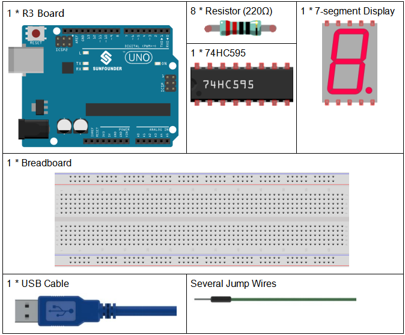
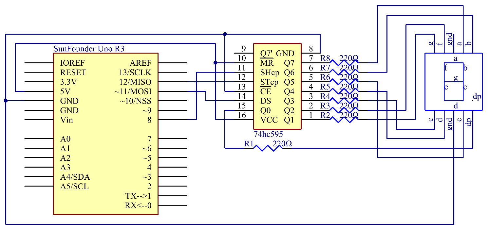
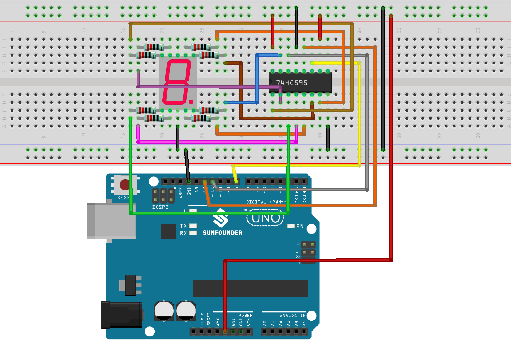
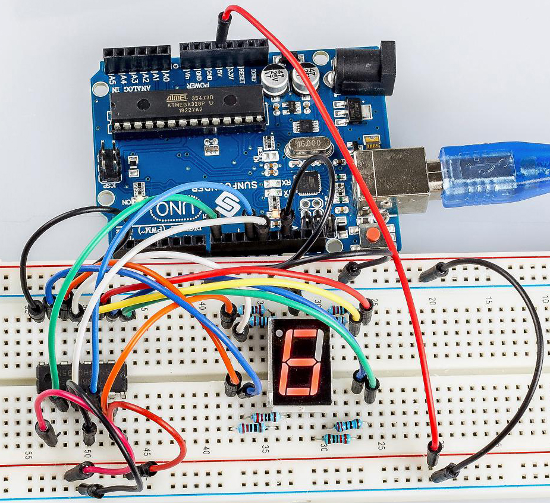

.. _74hc595_uno:

Lesson 18 74HC595
======================

Introduction
----------------------

Generally, there are two ways to drive a single 7-segment display. One
way is to connect its 8 pins directly to eight ports on the Uno board,
which we have done previously. Or you can connect the 74HC595 to three
ports of the UNO board and then the 7-segment display to the 74HC595. In
this experiment, we will use the latter. By this way, we can save five
ports – considering the Uno board’s limited ports, this is very
important. Now let's get started!

Components
----------------

* :ref:`SunFounder R3 Board`
* :ref:`Breadboard`
* :ref:`Jumper Wires`
* :ref:`Resistor`
* :ref:`7-segment Display`
* :ref:`74hc595`

Schematic Diagram
--------------------

In the experiment MR (pin10) is connected to 5V (HIGH Level) and OE (pin
1)  to GND (LOW Level). Therefore, the data is input into the rising
edge of SHcp and enters the memory register through the rising edge. We
use the shiftout() function to output a 8-bit data to the shift register
through DS. In the rising edge of the SHcp, the data in the shift
register moves successively one bit in one time, i.e. data in Q1 moves
to Q2, and so forth. In the rising edge of STcp, data in the shift
register moves into the memory register. All data will be moved to the
memory register after 8 times. Then the data in the memory register is
output to the bus (Q0-Q7). So the 16 characters are displayed in the
7-segment in turn.

Experimental Procedures
--------------------------------

**Step 1:** Build the circuit (pay attention to the direction
of the chip by the concave on it)

========= =========== ===========
7-Segment **74HC595** **Uno Kit**
a         Q7          
b         Q6          
c         Q5          
d         Q4          
e         Q3          
f         Q2          
g         Q1          
DP        Q0          
\         VCC         5V
\         DS          11
\         CE          GND
\         ST          12
\         SH          8
\         MR          5V
\         Q7’         N/C
\         GND         GND
-                     GND
========= =========== ===========

**Step 2:** Open the code file.

**Step 3:** Select the **Board** and **Port.**

**Step 4:** Upload the sketch to the board.

You should now see the 7-segment display from 0 to 9 and A to F.

Code
--------

.. raw:: html

   <iframe src=https://create.arduino.cc/editor/sunfounder01/c5d79729-d6ad-4afb-b9ee-4ad962151caf/preview?embed style="height:510px;width:100%;margin:10px 0" frameborder=0></iframe>

Code Analysis
-----------------

**Set the array elements**

.. code-block:: arduino

    int datArray[16] = {252, 96, 218, 242, 102, 182, 190, 224, 254, 246, 238, 62, 156, 122, 158, 142};

This array stores the data of the 16 characters from 0 to F. 252 stands
for 0, which you can calculate by yourself. To display 0, the segment g
(the middle one) of the 7-segment display must be low level (dim).

Since the segment g is connected to Q1 of the 74HC595, set both Q1 and
DP (the dot) as low level and leave the rest pins as high level.
Therefore, the values of Q7 Q6 Q5 Q4 Q3 Q2 Q1 Q0 are 1 1 1 1 1 1 0 0.

Change the binary numbers into decimal ones:
1x2\ :sup:`7`\ +1x2\ :sup:`6`\ +1x2\ :sup:`5`\ +1x2\ :sup:`4`\ +1x2\ :sup:`3`\ +1x2\ :sup:`2`\ +0x2\ :sup:`1`\ +1x2\ :sup:`0`\ =252.

So that's the value for the number **0** to be displayed. You can
calculate other characters similarly.

**Display 0-F in the 7-segment display**

.. code-block:: arduino

    for(int num = 0; num < 16; num++)

    {

      digitalWrite(STcp,LOW); //ground ST_CP and hold low for as long as you are transmitting

      shiftOut(DS,SHcp,MSBFIRST,datArray[num]);

      //return the latch pin high to signal chip that it

      //no longer needs to listen for information

      digitalWrite(STcp,HIGH); //pull the ST_CPST_CP to save the data

      delay(1000); //wait for a second

    }

Set *STcp* as low level first and then high level. It will generate a
rising edge pulse of STcp.

**shiftOut()** is used to shift out a byte of data one bit at a time,
which means to shift a byte of data in *dataArray[num]* to the shifting
register with the DS pin. *MSBFIRST* means to move from high bits.

After *digitalWrite(STcp,HIGH)* is run, the STcp will be at the rising
edge. At this time, the data in the shift register will be moved to the
memory register.

A byte of data will be transferred into the memory register after 8
times. Then the data of memory register is output to the bus (Q0-Q7).
You will see a character is displayed on the 7-segment. Then delay for
1000ms. After that line, go back to *for()*. The loop repeats until all
the characters are displayed in the 7-segment display one by one after
16 times.
