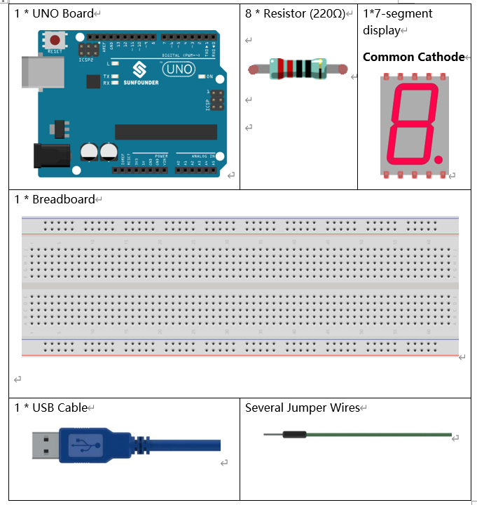
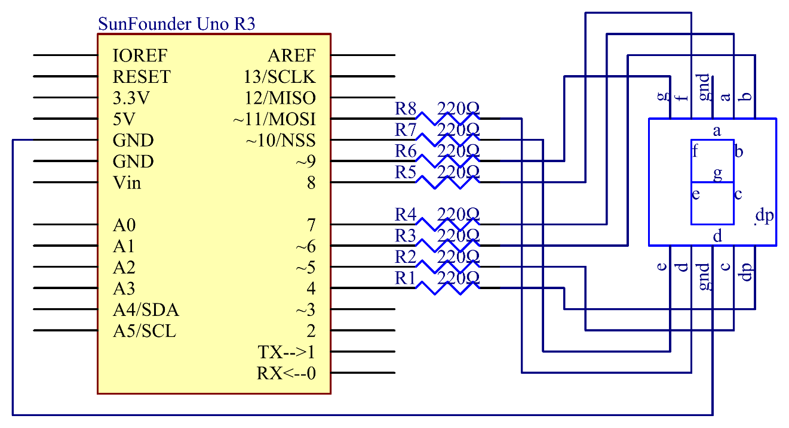
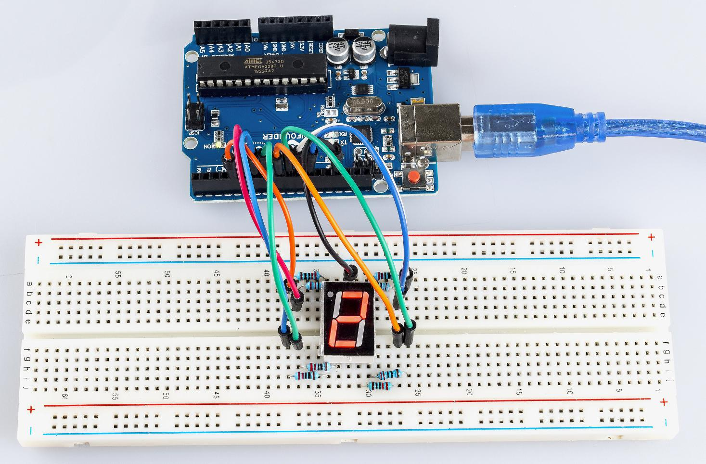

Lesson 17 7-Segment Display
================================

Introduction
-------------------

A 7-segment display is a device that can display numerals and letters.
It's made up of seven LEDs connected in parallel. Different
letters/numbers can be shown by connecting pins on the display to the
power source and enabling the related pins, thus turning on the
corresponding LED segments. In this lesson let's learn how to display
specific characters on it.

Components
----------------

Components Introduction
----------------------------

7-Segment Display
^^^^^^^^^^^^^^^^^^^^^^^^^

A 7-segment display is an 8-shaped component which packages 7 LEDs. Each
LED is called a segment – when energized, one segment forms part of a
numeral (both decimal and hexadecimal) to be displayed. An additional
8th LED is sometimes used within the same package thus allowing the
indication of a decimal point (DP) when two or more 7-segment displays
are connected together to display numbers greater than ten.

.. image:: media_uno/image155.jpeg
   :alt: IMG_256
   :width: 1.925in
   :height: 2.74583in
   :align: center

Each of the LEDs in the display is given a positional segment with one
of its connection pins led out from the rectangular plastic package.
These LED pins are labeled from "a" through to "g" representing each
individual LED. The other LED pins are connected together forming a
common pin. So by forward biasing the appropriate pins of the LED
segments in a particular order, some segments will brighten and others
stay dim, thus showing the corresponding character on the display.

The common pin of the display generally tells its type. There are two
types of pin connection: a pin of connected cathodes and one of
connected anodes, indicating Common Cathode (CC) and Common Anode (CA).
As the name suggests, a CC display has all the cathodes of the 7 LEDs
connected when a CA display has all the anodes of the 7 segments
connected.

Common Cathode 7-Segment Display
---------------------------------------

In a common cathode display, the cathodes of all the LED segments are
connected to the logic "0" or ground. Then an individual segment (a-g)
is energized by a "HIGH", or logic "1" signal via a current limiting
resistor to forward bias the anode of the segment.

.. image:: media_uno/image156.jpeg
   :alt: IMG_257
   :width: 3.00486in
   :height: 2.56667in
   :align: center

Common Anode 7-Segment Display
-----------------------------------

In a common anode display, the anodes of all the LED segments are
connected to the logic "1". Then an individual segment (a-g) is
energized by a ground, logic "0" or "LOW" signal via a current limiting
resistor to the cathode of the segment.

.. image:: media_uno/image157.jpeg
   :alt: IMG_258
   :width: 3.50278in
   :height: 3.02431in
   :align: center

Schematic Diagram
------------------------

In this experiment, connect each of pin a-g of the 7-Segment Display to
one 220ohm current limiting resistor respectively and then to pin 4–11.
GND connects to GND. By programming, we can set one or several of
pin4-11 as High level to light up the corresponding LED(s).

Experimental Procedures
-------------------------

**Step 1:** Build the circuit (here a common cathode 7-segment display
is used)

The wiring between the 7-segment display and the Uno board :

========= =========
7-Segment Uno Board
a         7
b         6
c         5
d         11
e         10
f         8
g         9
dp        4
“ - “     GND
========= =========

.. image:: media_uno/image159.png

   

**Step 2:** Open the code file.

**Step 3:** Select the **Board** and **Port.**

**Step 4:** Upload the sketch to the board.

You should now see the 7-segment display from 0 to 9 and then A to F,
back and forth.

Code Analysis
----------------------

The code may be a little long for this experiment. But the syntax is
simple. Let's take a look.

**Code Analysis** **19-1** **Call the function in loop()**

.. code-block:: arduino

   digital_1(); //diaplay 1 to the 7-segment

   delay(1000); //wait for a second

   digital_2(); //diaplay 2 to the 7-segment

   delay(1000); //wait for a second

   digital_3(); //diaplay 3 to the 7-segment

   delay(1000); //wait for a second

   digital_4(); //diaplay 4 to the 7-segment

Calling these functions into the loop() is to let the 7-Segment display
0-F. The functions are shown below. Take *digital_2()* for example:

**Code Analysis** **19-2** **Detailed analysis of digital_2()**

.. code-block:: arduino

   void digital_2(void) //diaplay 2 to the 7-segment

   {

   digitalWrite(b,HIGH);

   digitalWrite(a,HIGH);

   for(int j = 9;j <= 11;j++)

      digitalWrite(j,HIGH);

      digitalWrite(c,LOW);

      digitalWrite(f,LOW);

   }

.. image:: media_uno/image161.jpeg
   :width: 1.37986in
   :height: 1.76111in
   :align: center

First we need to know how it looks like when display the numeral **2**
on the 7-Segment display. It's actually the segments a, b, d, e and g
are power on, which generates the display of **2**. In programming, pins
connected to these segments are set High level when c and f are Low
level. Here we use a *for()* statement to set these pins as High level
respectively (the braces after *for()* are deleted as there is only one
line). Connect pin dp to pin 4; it's already defined as LOW in
*setup()*.

After running this part, the 7-segment will display **2**. Similarly,
the display of other characters are the same. Since the letters b and d
in upper case, namely **B** and **D**, would look the same with **8**
and **0** on the display, they are displayed in lower case instead.