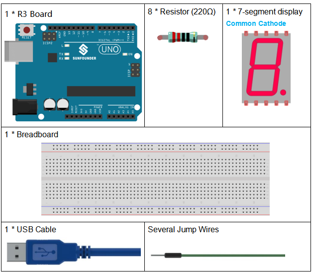
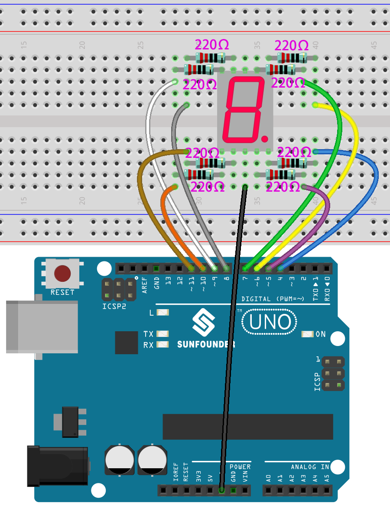
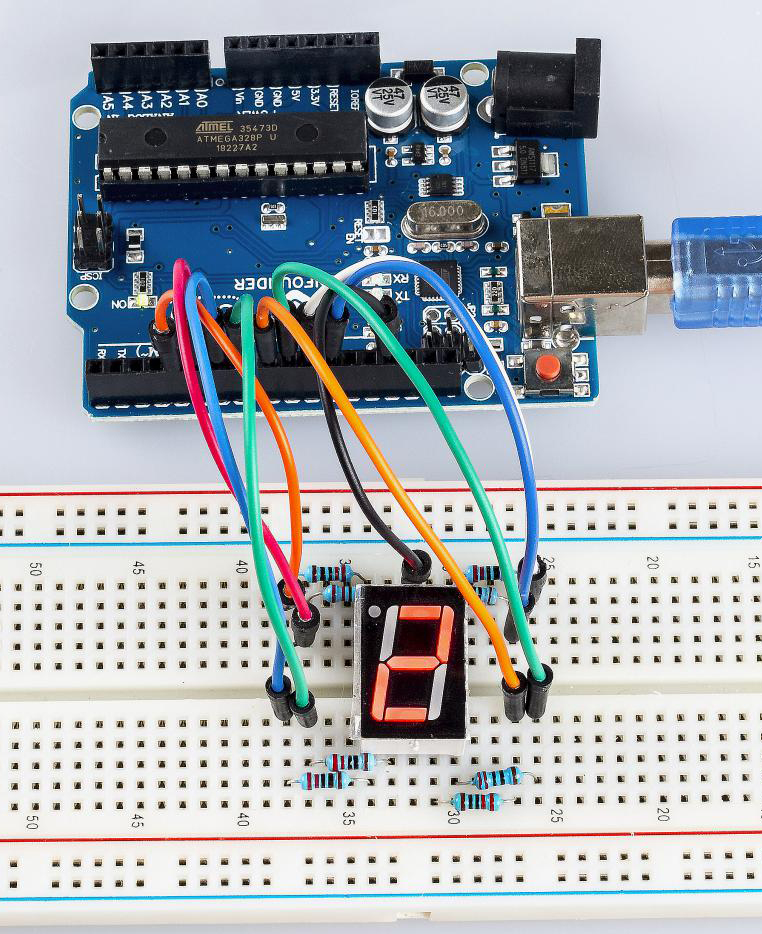

.. _7segmeng_uno:

Lesson 17 7-Segment Display
================================

Introduction
-------------------

A 7-segment display is a device that can display numerals and letters.
It's made up of seven LEDs connected in parallel. Different
letters/numbers can be shown by connecting pins on the display to the
power source and enabling the related pins, thus turning on the
corresponding LED segments. In this lesson let's learn how to display
specific characters on it.

Components
----------------

* :ref:`SunFounder R3 Board`
* :ref:`Breadboard`
* :ref:`Jumper Wires`
* :ref:`Resistor`
* :ref:`7-segment Display`

Schematic Diagram
------------------------

In this experiment, connect each of pin a-g of the 7-Segment Display to
one 220ohm current limiting resistor respectively and then to pin 4-11.
GND connects to GND. By programming, we can set one or several of
pin4-11 as High level to light up the corresponding LED(s).

.. image:: img/image158.png
   :align: center

Experimental Procedures
-------------------------

**Step 1:** Build the circuit (here a common cathode 7-segment display
is used)

The wiring between the 7-segment display and the Uno board :

========= =========
7-Segment Uno Board
a         7
b         6
c         5
d         11
e         10
f         8
g         9
dp        4
“ - “     GND
========= =========

**Step 2:** Open the code file.

**Step 3:** Select the **Board** and **Port.**

**Step 4:** Upload the sketch to the board.

You should now see the 7-segment display from 0 to 9 and then A to F,
back and forth.

Code
---------

.. raw:: html

   <iframe src=https://create.arduino.cc/editor/sunfounder01/9382b0e5-cec6-481d-abea-bed912587a42/preview?embed style="height:510px;width:100%;margin:10px 0" frameborder=0></iframe>

Code Analysis
----------------------

The code may be a little long for this experiment. But the syntax is simple. Let's take a look.

**Call the function in loop()**

.. code-block:: arduino

   digital_1(); //diaplay 1 to the 7-segment

   delay(1000); //wait for a second

   digital_2(); //diaplay 2 to the 7-segment

   delay(1000); //wait for a second

   digital_3(); //diaplay 3 to the 7-segment

   delay(1000); //wait for a second

   digital_4(); //diaplay 4 to the 7-segment

Calling these functions into the loop() is to let the 7-Segment display 0-F. The functions are shown below. Take ``digital_2()`` for example:

**Detailed analysis of digital_2()**

.. code-block:: arduino

   void digital_2()  //diaplay 2 to the 7-segment
   {
     turnOffAllSegments();
     digitalWrite(a, HIGH);
     digitalWrite(b, HIGH);
     digitalWrite(g, HIGH);
     digitalWrite(e, HIGH);
     digitalWrite(d, HIGH);
   }

.. image:: img/image161.jpeg
   :align: center

First, we need to understand how the numeral **2** appears on the 7-Segment display. It is achieved by powering on segments a, b, d, e, and g. In programming, pins connected to these segments are set to a High level while c and f are set to Low level. We start by using the function ``turnOffAllSegments()`` to turn off all segments and then light up the required ones.

After running this part, the 7-segment will display **2**. Similarly, the display of other characters are the same. Since the letters b and d in upper case, namely **B** and **D**, would look the same with **8** and **0** on the display, they are displayed in lower case instead.
