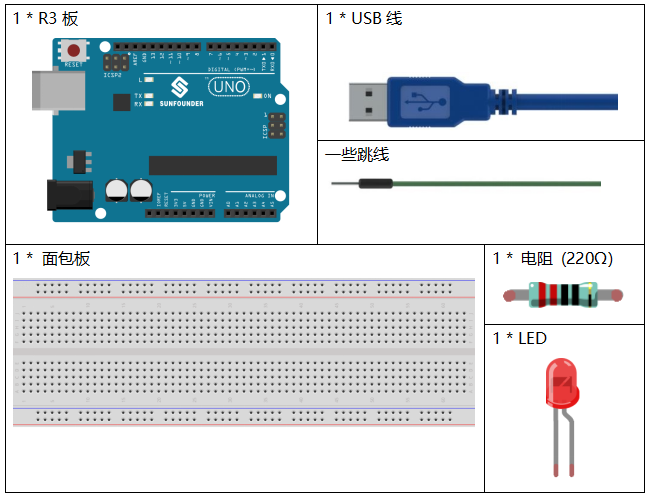
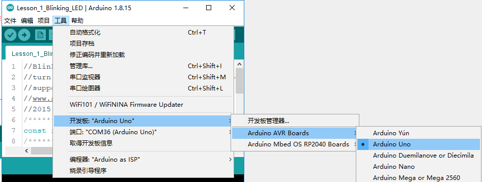
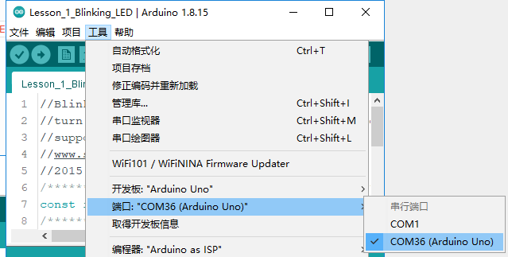
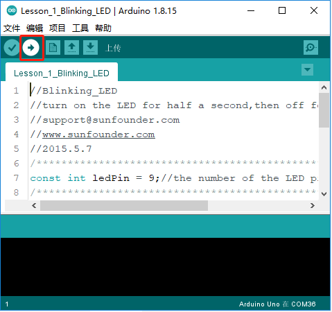
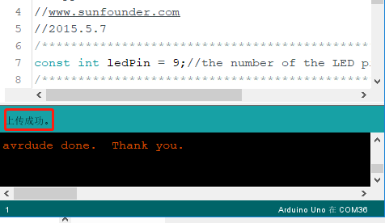
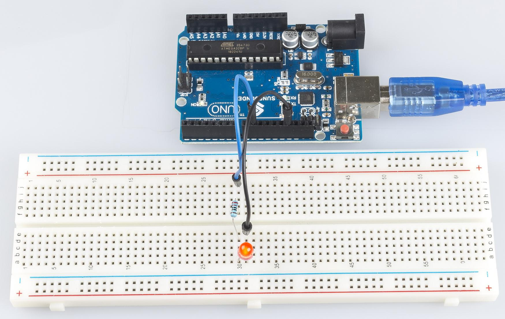

.. _blinking_uno:

第 1 课 闪烁的LED
===========================

介绍
---------------------

你之前应该已经学会了如何安装 Arduino IDE 并添加库。现在你可以从一个简单的实验开始，学习IDE中的基本操作和代码。

所需器件
--------------------

* :ref:`SunFounder R3板`
* :ref:`面包板`
* :ref:`跳线`
* :ref:`LED发光二极管`
* :ref:`电阻`

原理图
--------------

将220ohm电阻的一端接板子的9脚，另一端接LED的正极（长脚），LED的负极（短脚）接GND。当9脚输出高电平时，电流通过限流电阻到达LED的正极。由于 LED 的阴极连接到 GND，因此 LED 会亮起。当引脚 9 输出低电平时，LED 熄灭。

原理图如下所示：

.. image:: media_uno/image50.png
    :align: center

实验步骤
------------------------------

**第 1 步**：搭建电路。（LED上长的引脚为阳极）。
然后用一根USB线将板子插入到电脑上。

.. image:: media_uno/image51.png
    :align: center

**第 2 步**：打开路径 ``SunFounder Uno R3学习套件\Arduino项目代码\Lesson_1_Blinking_LED`` 中的代码文件 ``Lesson_1_Blinking_LED.ino``。

**第 3 步**：在上传代码前，你需要选择正确的开发板和端口。

点击 **工具** -》 **开发板**，然后选择 **Arduino Uno**。

然后再点击 **工具** -》 **端口**，你的端口应该和我的不一样。

**第 4 步**：点击 **上传** 按钮来将代码上传到主板上。

**第 5 步**：如果 **上传成功** 提示出现，代表代码已成功上传到主板上。

现在你将看到LED闪烁。

代码
-------

.. raw:: html

    <iframe src=https://create.arduino.cc/editor/sunfounder01/e074c00b-6edf-461a-9d6e-38c20d6da95a/preview?embed style="height:510px;width:100%;margin:10px 0" frameborder=0></iframe>

代码分析
-----------------

**定义变量**

.. code-block:: arduino

    const int ledPin = 9; //the number of the LED pin

你应该在使用前定义每个变量，以防出错。该行为引脚9定义了一个常量变量ledPin。
在下面的代码中，ledPin代表引脚9。你也可以直接使用引脚9代替。

**setup() 函数**

一个典型的 Arduino 程序由两个子程序组成：用于初始化的 ``setup()`` 和包含程序主体的 ``loop()``。

* ``setup()``：该函数通常用于初始化数字引脚，并将它们设置为输入或输出，以及串行通信的波特率。
* ``loop()``：该函数包含了整个代码运行顺序，将循环运行，除非发生停电之类的事情，否则它不会停止。

.. code-block:: arduino

    void setup()
    {
        pinMode(ledPin,OUTPUT);//initialize the digital pin as an output
    }

在 ``setup()`` 函数中将 ``ledPin`` 设置为输出。

* ``pinMode(Pin)``：将指定的引脚配置为输入或输出。

setup 之前的 void 意味着这个函数不会返回值。即使不需要初始化引脚，你仍然需要此功能。否则编译会出错。

**loop()函数**

.. code-block:: arduino

    void loop()
    {
        digitalWrite(ledPin,HIGH);//turn the LED on 
        delay(500);               //wait for half a second
        digitalWrite(ledPin,LOW); //turn the LED off
        delay(500);               //wait for half a second
    }

本程序是设置 ``ledPin`` 为 ``HIGH`` 来让LED点亮，使用 ``delay()`` 函数来设置点亮时间，单位为毫秒。
同样，设置为 ``LOW`` 将让LED熄灭，时间为500毫秒。代码上传之后，你将看到LED点亮500毫秒(0.5秒)，熄灭500毫秒（0.5秒），这种交替不会停止，除非断电。

* ``digitWrite()``：写一个 ``HIGH`` 或 ``LOW`` 值到数字引脚。当此引脚在 ``pinModel()`` 函数中设置为输出时，其电压将设置为相应的值：5V（或 3.3V 板上的 3.3V）代表高，0V（地）代表低。

实验总结
----------------------
通过这个实验，你已经学会了如何打开 LED。你还可以通过更改 ``delay (num)`` 中的num值来更改 LED 的闪烁频率。例如，将其更改为 ``delay(250)``，你会发现 LED 闪烁更快。