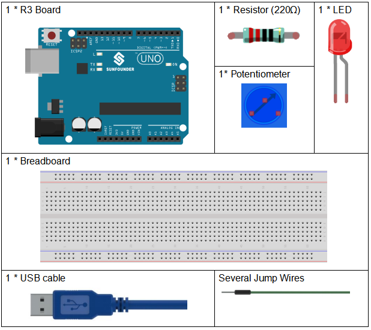
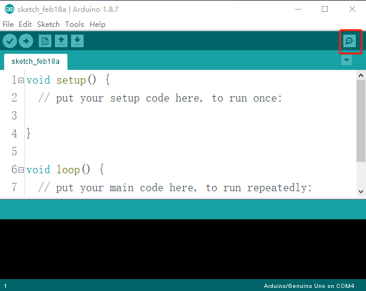
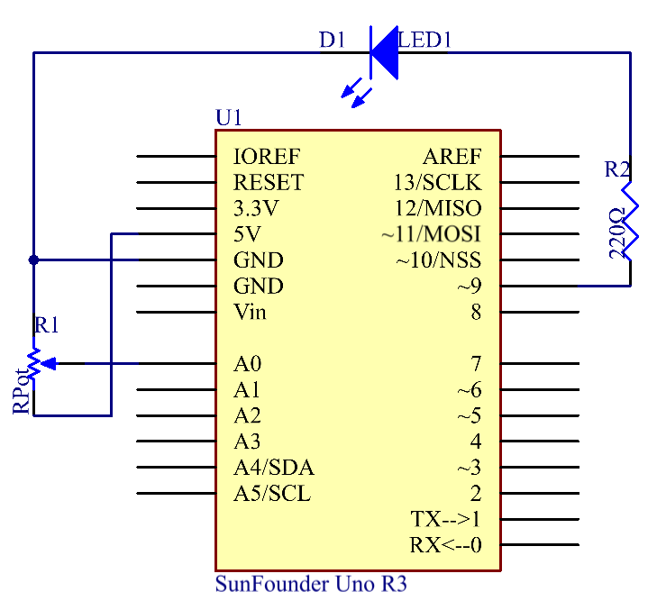
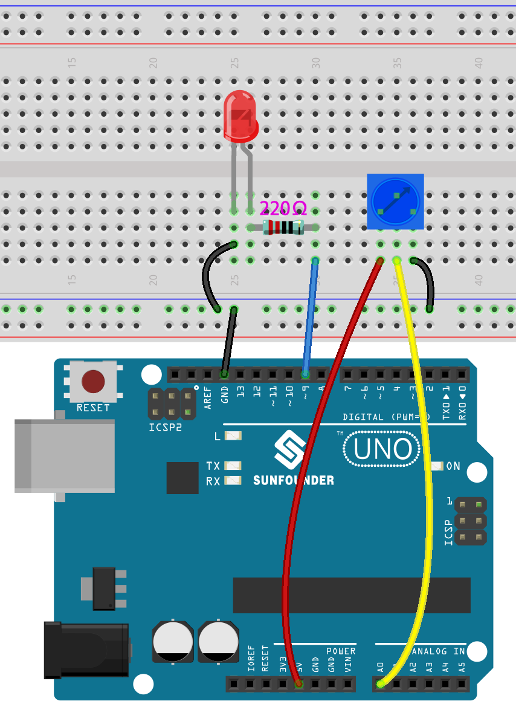
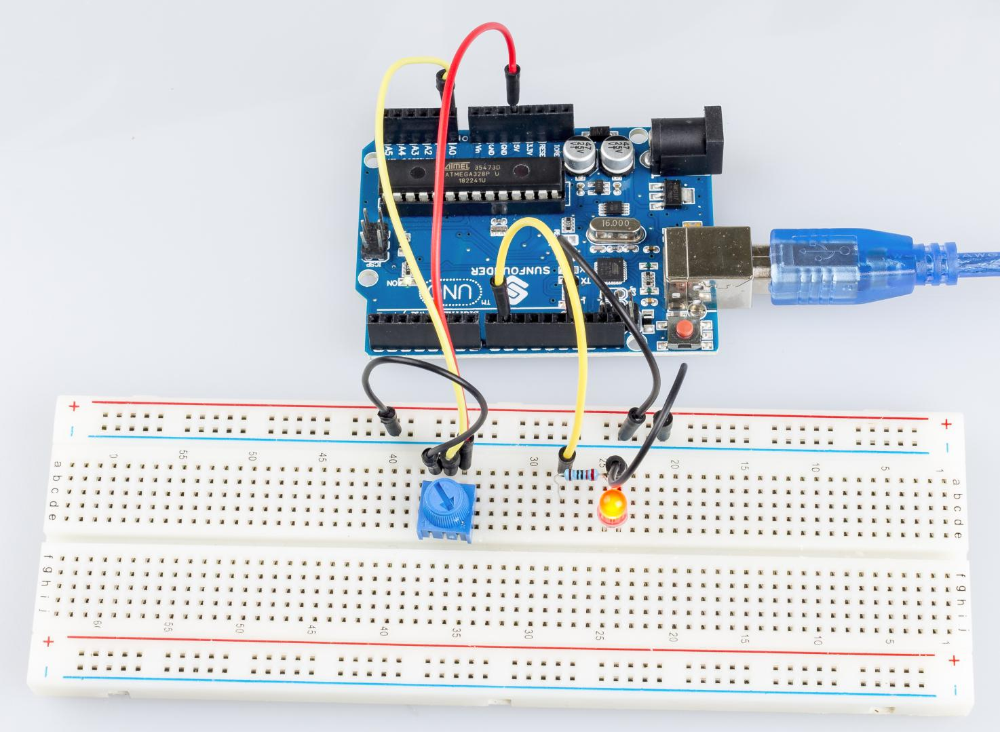

Lesson 8 Controlling an LED by Potentiometer
===================================================

Introduction
--------------------

In this lesson, let’s see how to change the luminance of an LED by a
potentiometer, and receive the data of the potentiometer in Serial
Monitor to see its value change.

Components
----------------

Component Introduction
----------------------------

Potentiometer
^^^^^^^^^^^^^^^^^^^^^^^

Potentiometer is also a resistance component with 3 terminals and its
resistance value can be adjusted according to some regular variation.
Potentiometer usually consists of resistor and movable brush. When the
brush is moving along the resistor, there is a certain resistance or
voltage output depending on the displacement.

.. image:: media_uno/uno12.png
    :align: center

The functions of the potentiometer in the circuit are as follows:

1. Serving as a voltage divider

..

   Potentiometer is a continuously adjustable resistor. When you adjust
   the shaft or sliding handle of the potentiometer, the movable contact
   will slide on the resistor. At this point, a voltage can be output
   depending on the voltage applied onto the potentiometer and the angle
   the movable arm has rotated to or the travel it has made.

2. Serving as a rheostat

..

   When the potentiometer is used as a rheostat, connect the middle pin
   and one of the other 2 pins in the circuit. Thus you can get a
   smoothly and continuously changed resistance value within the travel
   of the moving contact.

3. Serving as a current controller

..

   When the potentiometer acts as a current controller, the sliding
   contact terminal must be connected as one of the output terminals.

Serial Monitor
--------------------

Serial Monitor is used for communication between the Uno board and a
computer or other devices. It is a built-in software in the Arduino
environment and you can click the button on the upper right corner to
open it. You can send and receive data via the serial port on the
control board and control the board by input from the keyboard.

Here, the Serial Monitor serves as a transfer station for communication
between your computer and the Uno board. First, the computer transfers
data to the Serial Monitor, and then the data is read by the Uno board.
Finally, the Uno will perform related operations. Click the icon at the
top right corner and a window will pop up as shown below:

   .. image:: media_uno/image105.png

Analog V.S. Digital
------------------------

A linear potentiometer is an analog electronic component. So what’s the
difference between an analog value and a digital one? Simply put,
digital means on/off, high/low level with just two states, either 0
or 1. But the data state of analog signals is linear, for example, from
1 to 1000; the signal value changes over time instead of indicating an
exact number. Analog signals include those of light intensity, humidity,
temperature, and so on.

.. image:: media_uno/image106.png

Schematic Diagram
---------------------------

In this experiment, the potentiometer is used as voltage divider,
meaning connecting devices to all of its three pins. Connect the middle
pin of the potentiometer to pin A0 and the other two pins to 5V and GND
respectively. Therefore, the voltage of the potentiometer is 0-5V. Spin
the knob of the potentiometer, and the voltage at pin A0 will change.
Then convert that voltage into a digital value (0-1024) with the AD
converter in the control board. Through programming, we can use the
converted digital value to control the brightness of the LED on the
control board.

Experimental Procedures
--------------------------------

**Step 1:** Build the circuit.

   

**Step 2:** Open the code file.

**Step 3:** Select the **Board** and **Port.**

**Step 4:** Upload the sketch to the board.

**Step 5:** Open the Serial Monitor.

Find the Serial.begin() code to see what baud rate is set, here is 9600.
Then click the top right corner icon to open the Serial Monitor.

.. image:: media_uno/image109.png

**Step 6:** Set the baud rate to 9600.

The default baud rate for serial monitors is 9600, and if the code is
also set to 9600, there is no need to change the baud rate bar.

.. image:: media_uno/image110.png

Spin the shaft of the potentiometer and you should see the luminance of
the LED change.

If you want to check the corresponding value changes, open the Serial
Monitor and the data in the window will change with your spinning of the
potentiometer knob.

Code 
-------

.. raw:: html

   <iframe src=https://create.arduino.cc/editor/sunfounder01/1f9479dd-17c8-40bf-bff4-f0c7a4f66895/preview?embed style="height:510px;width:100%;margin:10px 0" frameborder=0></iframe>   

Code Analysis
---------------

**Code Analysis** **10-1** **Read the value from A0**

.. code-block:: arduino

    inputValue = analogRead(analogPin);//read the value from the potentiometer

This line is to store the values A0 has read in the *inputValue* which
has been defined before.

**analog Read()** reads the value from the specified analog pin. This
means that it will map input voltages between 0 and 5 volts into integer
values between 0 and 1023.

**Code Analysis** **10-2 Print values on Serial Monitor**

.. code-block:: arduino

    Serial.print("Input: "); //print "Input"

    Serial.println(inputValue); //print inputValue

**Serial.print():**\ Prints data to the serial port as human-readable
ASCII text. This command can take many forms. Numbers are printed using
an ASCII character for each digit. Floats are similarly printed as ASCII
digits, defaulting to two decimal places. Bytes are sent as a single
character. Characters and strings are sent as is.

**Serial.print():** Commandant takes the same forms as Serial.print(),
but it is followed by a carriage return character (ASCII 13, or '\\r')
and a newline character (ASCII 10, or '\\n').

**Code Analysis 10-3 Map the values**

.. code-block:: arduino

    outputValue = map(inputValue, 0, 1023, 0, 255); //Convert from 0-1023 proportional to the number of a number of from 0 to 255

**map(value, Fromm, from High, to Low, thigh)** re-maps a number from
one range to another. That is, a **value** of **Fromm** would get mapped
to one of **to Low**, and a value of **from High** to one of **thigh**,
values in-between to values in-between, etc.

As the range of *led Pin* (pin 9) is 0-255, we need to map 0-1023 with
0-255.

Display the output value in Serial Monitor in the same way. If you are
not so clear about the *map()* functions, you can observe the data in
the Serial Monitor and analyze it.

.. code-block:: arduino

    Serial.print("Output: "); //print "Output"

    Serial.println(outputValue); //print outputValue

**Code Analysis** **10-4** **Write the value of the potentiometer to
LED**

.. code-block:: arduino

    analogWrite(ledPin, outputValue); //turn the LED on depending on the output value

Write the output value to *led Pin* and you will see that the luminance
of LED changes with your spinning of the potentiometer knob.

**analog Write()**: Writes an analog value (PWM wave) to a pin. It has
nothing to do with an analog pin, but is just for PWM pins. You do not
need to call the *incommode()* to set the pin as output before calling
*analog Write()*.

Experiment Summary
------------------------

This experiment can also be changed to others as you like. For example,
use the potentiometer to control the time interval for the LED blinking.
It is to use the value read from the potentiometer for delaying, as
shown below. Have a try!

.. code-block:: arduino

    inputValue = analogRead(analogPin);

    digitalWrite(ledPin, HIGH);

    delay(inputValue);

    digitalWrite(ledPin, LOW);

    delay(inputValue);