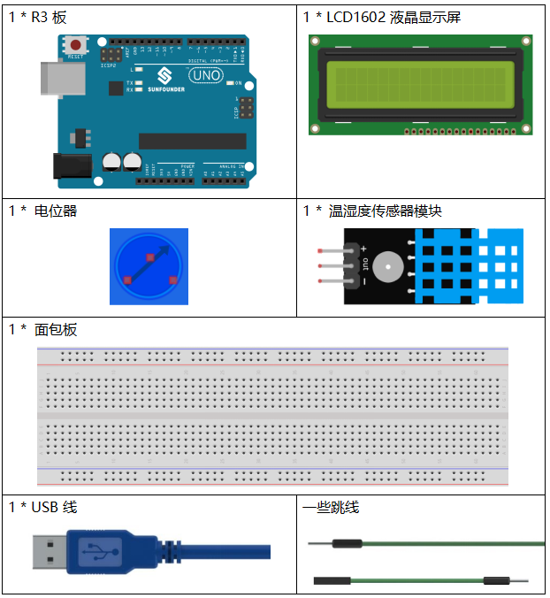
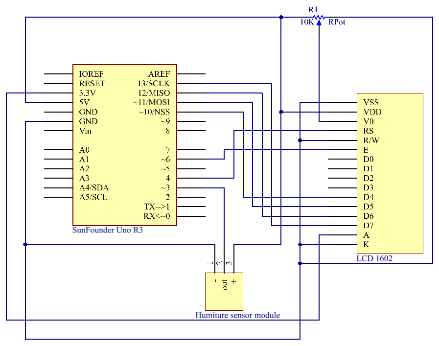
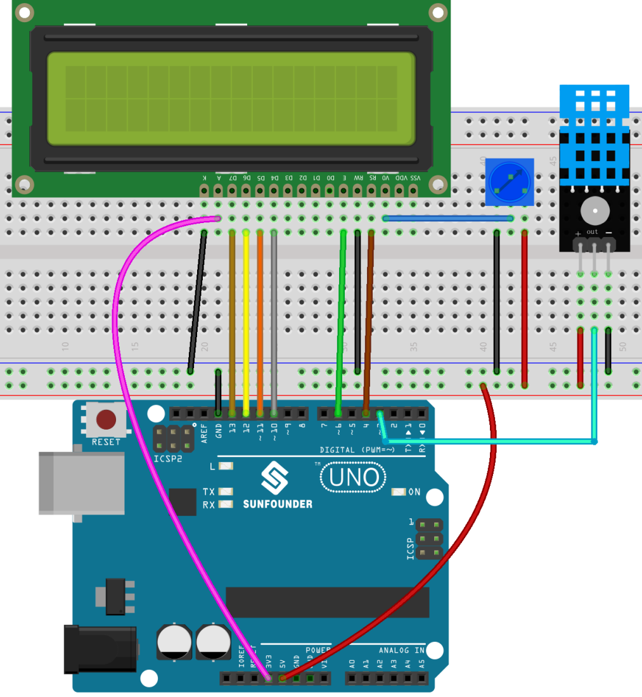
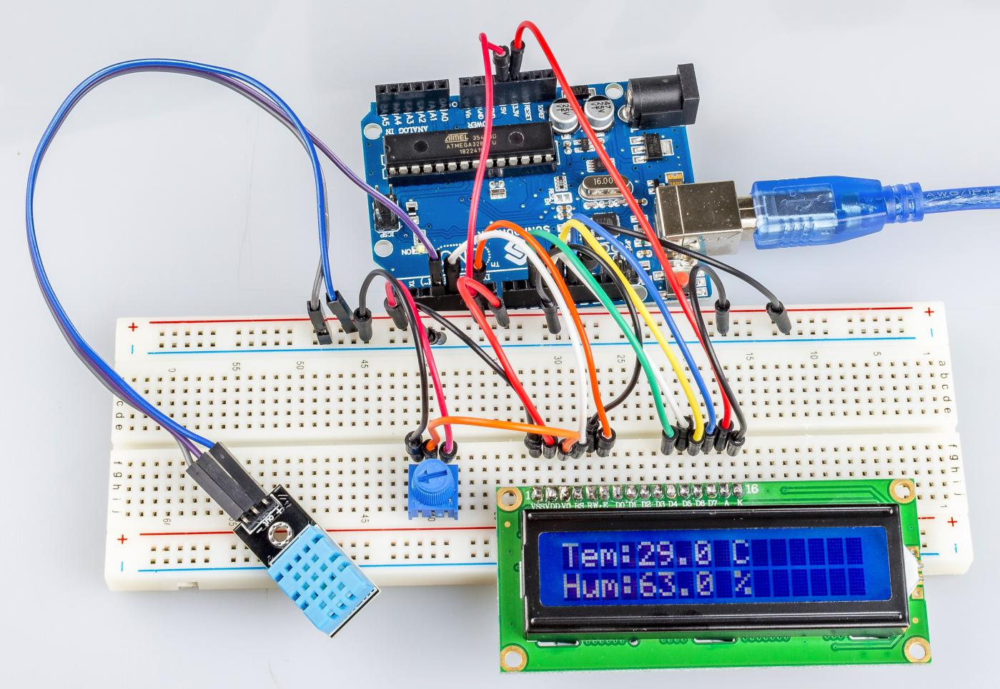

.. _humi_uno:

第 15 课 温湿度传感器
============================

介绍
---------------------

数字温湿度传感器 DHT11 是一种复合传感器，包含经过校准的温湿度数字信号输出。采用专用数字模块采集技术和温湿度传感技术，确保产品具有高可靠性和优异的长期稳定性。

该传感器包括电阻感湿元件和NTC测温装置，并与高性能8位微控制器相连。

所需器件
---------------

* :ref:`SunFounder R3板`
* :ref:`面包板`
* :ref:`跳线`
* :ref:`LCD1602液晶显示屏`
* :ref:`电位器`
* :ref:`温湿度传感器模块`

原理图
------------------------------

实验步骤
-------------------------------

**第 1 步**：搭建电路。.

**第 2 步**：打开代码文件 ``Lesson_15_Humiture_Sensor.ino``。

**第 3 步**：选择 **开发板** 和 **端口**。

**第 4 步**：点击 **上传** 按钮来上传代码。

现在，你可以看到 LCD1602 上显示的当前湿度和温度值。

代码
-------

.. raw:: html

    <iframe src=https://create.arduino.cc/editor/sunfounder01/214bcc9b-c7db-4df9-b2a7-4b50f30e381b/preview?embed style="height:510px;width:100%;margin:10px 0" frameborder=0></iframe>

代码分析
-----------------------

**初始化温湿度和LCD1602**

.. code-block:: arduino

    #include <dht.h> // Include the head file dht.h
    #include <LiquidCrystal.h> 
    LiquidCrystal lcd(4, 6, 10, 11, 12, 13); // initialize the LCD1602
    dht DHT;
    #define DHT11_PIN 3 // the humiture sensor attact to pin3

**读温湿度传感器的值**

.. code-block:: arduino

    int chk = DHT.read11(DHT11_PIN);
    switch (chk)
    {
        case DHTLIB_OK:  
            Serial.println("OK,\t"); 
            break;
        case DHTLIB_ERROR_CHECKSUM: 
            Serial.println("Checksum error,\t"); 
            break;
        case DHTLIB_ERROR_TIMEOUT: 
            Serial.println("Time out error,\t"); 
            break;
        default: 
            Serial.println("Unknown error,\t"); 
            break;
    }

使用该 ``read11()`` 函数读取温湿度传感器的值。如果串口监视器上显示 OK，则说明温湿度传感器工作正常。

* ``read11()``：返回值：

.. code-block:: arduino

    // DHTLIB_OK: Indicate the humiture sensor is work well.
    // DHTLIB_ERROR_CHECKSUM
    // DHTLIB_ERROR_TIMEOUT

**LCD1602上的显示**

.. code-block:: arduino

    lcd.setCursor(0, 0);
    lcd.print("Tem:");
    lcd.print(DHT.temperature,1); //print the temperature on lcd
    lcd.print(" C");
    lcd.setCursor(0, 1);
    lcd.print("Hum:");
    lcd.print(DHT.humidity,1); //print the humidity on lcd
    lcd.print(" %"); 
    delay(200); //wait a while 