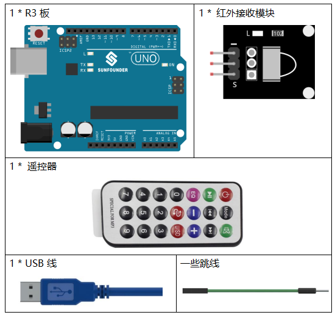
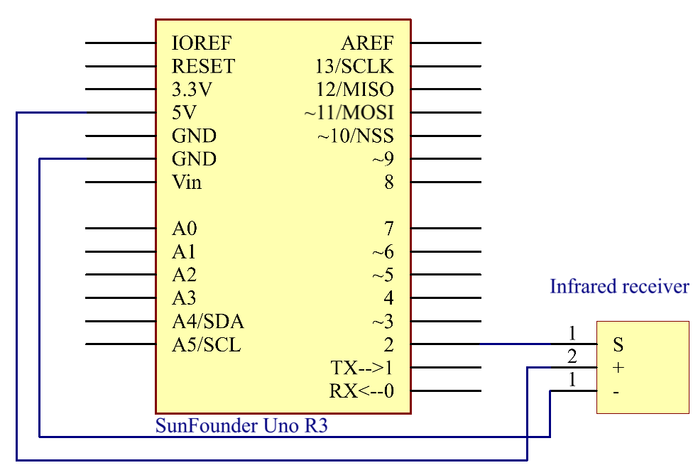
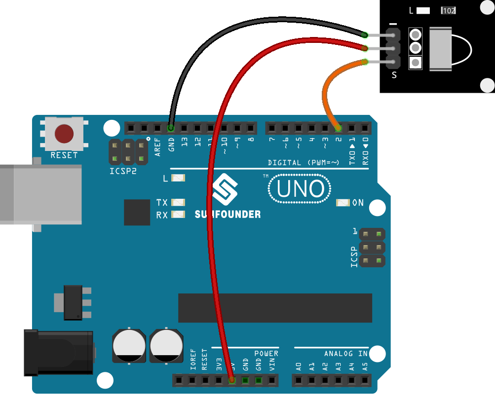

Lesson 14 Infrared-Receiver
================================

Introduction
------------------

An infrared-receiver is a component that receives infrared signals and
can independently receive infrared ray and output signals compatible
with TTL level. It's similar with a normal plastic-packaged transistor
in size and it is suitable for all kinds of infrared remote control and
infrared transmission.

Components
----------------

Schematic Diagram
---------------------

Control a certain key (for example, Power key) via a remote controller
by programming. When you press the key, infrared rays will be emitted
from the remote controller and received by the infrared receiver, and
the LED on the Uno board will light up.

Experimental Procedures
------------------------------

**Step 1:** Build the circuit.

**Step 2:** Open the code file.

**Step 3:** Select the **Board** and **Port.**

**Step 4:** Upload the sketch to the board.

Now, press Power on the remote control and the LED attached to pin 13 on
the Uno board will light up. If you press other keys, the LED will go
out.

.. Note::

    1) There is a transparent plastic piece at the back of the remote
    control to cut off the power and pull it out before you use the
    remote control.

    1) Please gently press the button on the remote to avoid invalid data
    FFFFFFFF.

    .. image:: media_uno/image142.png

    .. image:: media_uno/image143.jpeg

Code 
-------

.. raw:: html

    <iframe src=https://create.arduino.cc/editor/sunfounder01/42ad3e60-0233-4b65-b930-971a4f744527/preview?embed style="height:510px;width:100%;margin:10px 0" frameborder=0></iframe>

Code Analysis
-----------------

**Code Analysis** **16-1** **Initialize the infrared-receiver**

.. code-block:: arduino

    #include <IRremote.h>

    const int irReceiverPin = 2; //the infrared-receiver attact to pin2

    const int ledPin = 13; //built-in LED

    IRrecv irrecv(irReceiverPin); //Initialize the infrared-receiver

    decode_results results; //The decoding result is placed in the result of the decode results structure.

**Code Analysis** **16-2** **Enable infrared-receiver**

.. code-block:: arduino

    irrecv.enableIRIn(); //Restart the receiver

**Code Analysis** **16-3** **Receive and print the data**

.. code-block:: arduino

    if (irrecv.decode(&results)) { //If receive a data

**decode(&results):** Decodes the received IR message, returns 0 if no
data ready, 1 if data ready. Results of decoding are stored in results

.. code-block:: arduino

        Serial.print("irCode: "); //print "irCode: " on the serial monitor

        Serial.print(results.value, HEX); //print the signal on serial monitor in hexadecimal

        Serial.print(", bits: ");

        Serial.println(results.bits); // Print the data bits

        irrecv.resume(); //Receive next data

    }

    delay(600);

**Code Analysis** **16-4** **If the power button is pressed**

.. code-block:: arduino

    if(results.value == 0xFFA25D) // if the power button on the remote control is pressed

The 0xFFA25D is the code of the power button on the remote control, if
you want to define other button, you can read the code of every button
from the serial monitor.

.. image:: media_uno/image142.png
   :align: center

.. code-block:: arduino

    {

        digitalWrite(ledPin,HIGH); //Turn on the LED

    }

    else

    {

        digitalWrite(ledPin,LOW); //else turn of the LED

    }