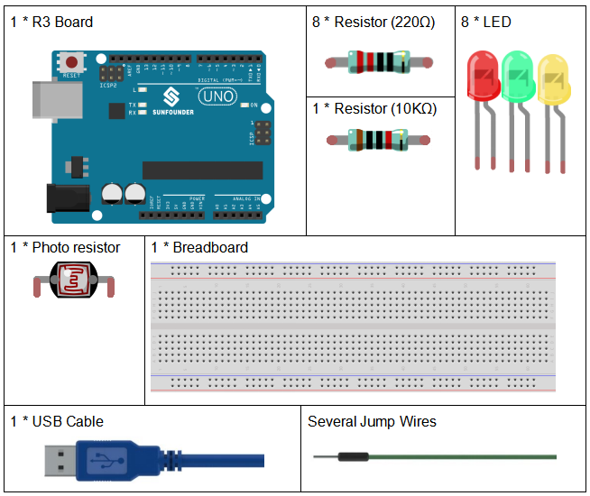
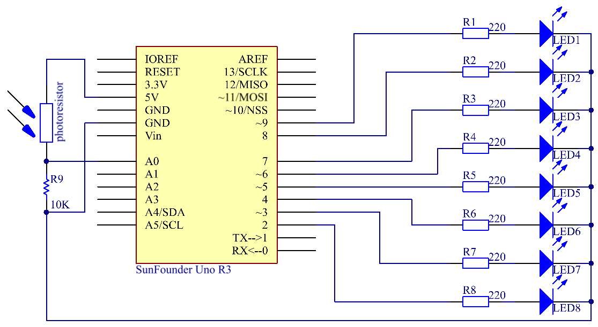

.. _photoresistor_uno:

Lesson 9 Photo resistor
=============================

Introduction
---------------------

In this lesson, you will learn to how to measure light intensity using a
photo resistor. The resistance of a photo resistor changes with incident
light intensity. If the light intensity gets higher, the resistance
decreases; if it gets lower, the resistance increases.

Components
---------------

* :ref:`SunFounder R3 Board`
* :ref:`Breadboard`
* :ref:`Jumper Wires`
* :ref:`LED`
* :ref:`Resistor`
* :ref:`Photoresistor`

Schematic Diagram
---------------------

Experimental Procedures
---------------------------

**Step 1:** Build the circuit.

.. image:: media_uno/image116.png

**Step 2:** Open the code file.

**Step 3:** Select the **Board** and **Port.**

**Step 4:** Upload the sketch to the board.

Now, shine some light on the photo resistor, and you will see several
LEDs light up. Shine more light and you will see more LEDs light up.
When you place it in a dark environment, all the LEDs will go out.

.. image:: media_uno/image117.jpeg

Code
--------

.. raw:: html

    <iframe src=https://create.arduino.cc/editor/sunfounder01/7484bb92-34dd-468e-b5f6-6400453fd9f6/preview?embed style="height:510px;width:100%;margin:10px 0" frameborder=0></iframe>

Code Analysis
------------------------

**Set the variables**

.. code-block:: arduino

    const int NbrLEDs = 8; // 8 leds

    const int ledPins[] = {2, 3, 4, 5, 6, 7, 8, 9}; // 8 leds attach to pin 5-12 respectively

    const int photocellPin = A0; // photoresistor attach to A0

    int sensorValue = 0; // value read from the sensor

    int ledLevel = 0; // sensor value converted into LED 'bars'

The 8 LEDs are connected to pin5-pin12, in this code, use a array to
store the pins, ledPins[0] is equal to 5, ledPins[1] to 6 and so on.

**Set 8 pins to OUTPUT**

.. code-block:: arduino

    for (int led = 0; led < NbrLEDs; led++)

    {

        pinMode(ledPins[led], OUTPUT); // make all the LED pins outputs

    }

Using the for() statement set the 8 pins to OUTPUT. The variable led is
added from 0 to 8, and the pinMode() function sets pin5 to pin12 to
OUTPUT in turn.

**Read the analog value of the photoresistor**

.. code-block:: arduino

    sensorValue = analogRead(photocellPin); // read the value of A0

Read the analog value of the **photocellPin(A0**) and store to the
variable **sensorValue.**

**analogRead():** Reads the value from the specified analog pin. Arduino
boards contain a multichannel, 10-bit analog to digital converter. This
means that it will map input voltages between 0 and the operating
voltage(5V or 3.3V) into integer values between 0 and 1023.

.. code-block:: arduino

    Serial.print("SensorValue: ");

    Serial.println(sensorValue); // Print the analog value of the photoresistor

Use the Serial.print()function to print the analog value of the
photoresistor. You can see them on the Serial Monitor.

**Serial.print():**\ Prints data to the serial port as human-readable
ASCII text. This command can take many forms. Numbers are printed using
an ASCII character for each digit. Floats are similarly printed as ASCII
digits, defaulting to two decimal places. Bytes are sent as a single
character. Characters and strings are sent as is.

**Serial.println():** Thiscommand takes the same forms as
Serial.print(), but it is followed by a carriage return character (ASCII
13, or '\r') and a newline character (ASCII 10, or '\n').

**Map the analog value to 8 LEDs**

.. code-block:: arduino

    ledLevel = map(sensorValue, 0, 1023, 0, NbrLEDs); // map to the number of LEDs

    Serial.print("ledLevel: ");

    Serial.println(ledLevel);

The map() command is used to map 0-1023 to 0-NbrLEDs(8),
(1023-0)/(8-0)=127.875

+-------+-------+-------+-------+-------+-------+-------+-------+
| 0-12  | 128-2 | 2     | 384-  | 5     | 640-7 | 7     | 896   |
| 7.875 | 55.75 | 56-38 | 511.5 | 12-63 | 67.25 | 68-89 | -1023 |
|       |       | 3.625 |       | 9.375 |       | 5.125 |       |
+-------+-------+-------+-------+-------+-------+-------+-------+
| 0     | 1     | 2     | 3     | 4     | 5     | 6     | 7     |
+-------+-------+-------+-------+-------+-------+-------+-------+

If sensorValue is 560, then the ledLevel is 4.

``map(value, fromLow, fromHigh, toLow, toHigh)`` re-maps a number from
one range to another. That is, a value of ``fromLow`` would get mapped to
one of ``toLow``, and a value of ``fromHigh`` to one of ``toHigh``, values
in-between to values in-between, etc.

**Light up the LEDs**

.. code-block:: arduino

    for (int led = 0; led < NbrLEDs; led++)

    {

        if (led <= ledLevel ) //When led is smaller than ledLevel, run the following code.

        {

            digitalWrite(ledPins[led], HIGH); // turn on pins less than the level

        }

        else

        {

            digitalWrite(ledPins[led], LOW); // turn off pins higher than

        }

    }

Light up the corresponding LEDs. Such as, when the ledLevel is 4, then
light up the ledPins[0] to ledPins[4] and go out the ledPins[5] to
ledPins[7].