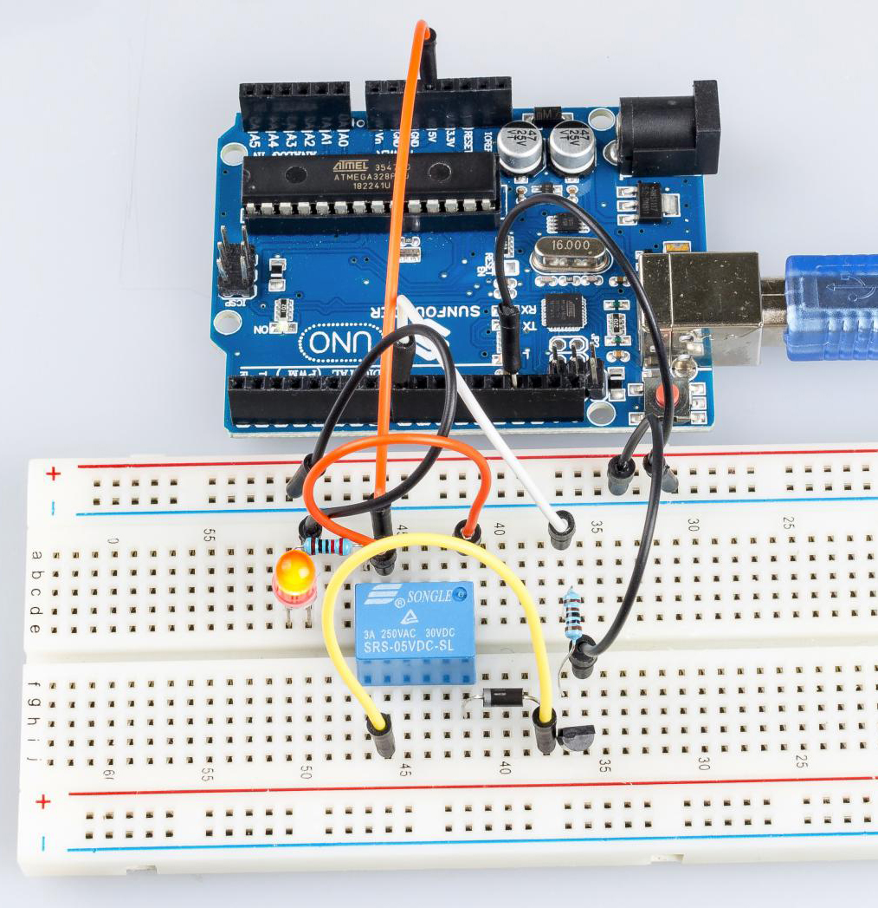

.. _relay_uno:

Lesson 6 Relay
===================

Introduction
------------------

As we may know, relay is a device which is used to provide connection
between two or more points or devices in response to the input signal
applied. In other words, relays provide isolation between the controller
and the device as devices may work on AC as well as on DC. However, they
receive signals from a micro-controller which works on DC hence
requiring a relay to bridge the gap. Relay is extremely useful when you
need to control a large amount of current or voltage with small
electrical signal.

Components
----------------

.. image:: img/uno08.png
    :align: center

* :ref:`SunFounder R3 Board`
* :ref:`Breadboard`
* :ref:`Jumper Wires`
* :ref:`Resistor`
* :ref:`Relay`
* :ref:`Transistor`
* :ref:`Diode`
* :ref:`LED`

Schematic Diagram
-----------------------

Connect a 1K resistor (for current limiting when the transistor is
energized) to pin 8 of the SunFounder Uno board, then to an NPN
transistor whose collector is connected to the coil of a relay and
emitter to GND; connect the normally open contact of the relay to an LED
and then GND. Therefore, when a High level signal is given to pin 8, the
transistor is energized, thus making the coil of the relay conductive.
Then its normally open contact is closed, and the LED will light up.
When pin 8 is given a Low level, the LED will stay dim.

.. image:: img/image87.png

**Function of the freewheeling diode**: When the voltage input changes
from High (5V) to Low (0V), the transistor changes from saturation
(three working conditions: amplification, saturation, and cut-off) to
cut-off, the current in the coil suddenly has no way to flow through. At
this moment, without the freewheeling diode, a counter-electromotive
force (EMF) will be generated at the ends of the coil, with positive at
the bottom and negative at the top, a voltage higher than 100V. This
voltage plus that from the power at the transistor are big enough to
burn it. Therefore, the freewheeling diode is extremely important in
discharging this counter-EMF in the direction of the arrow in the figure
above, so the voltage of the transistor to GND is no higher than +5V
(+0.7V).

In this experiment, when the relay closes, the LED will light up; when
the relay opens, the LED will go out.

Experimental Procedures
-----------------------------

**Step 1:**\ Build the circuit

.. image:: img/image88.png

**Step 2:** Open the code file.

**Step 3:** Select the **Board** and **Port.**

**Step 4:** Upload the sketch to the board.

Now, send a High level signal, and the relay will close and the LED will
light up; send a low one, and it will open and the LED will go out. In
addition, you can hear a tick-tock caused by breaking the normally close
contact and closing the normally open one.

Code
--------

.. raw:: html

   <iframe src=https://create.arduino.cc/editor/sunfounder01/581e0c6c-c268-4cfe-aedf-5de80eb61315/preview?embed style="height:510px;width:100%;margin:10px 0" frameborder=0></iframe>

Code Analysis
-----------------

.. code-block:: arduino

    void loop()

    {

      digitalWrite(relayPin, HIGH); //drive relay closure conduction

      delay(1000); //wait for a second

      digitalWrite(relayPin, LOW); //drive the relay is closed off

      delay(1000); //wait for a second

    }

The code in this experiment is simple. First, set relayPin as HIGH level
and the LED connected to the relay will light up. Then set relayPin as
LOW level and the LED goes out.
