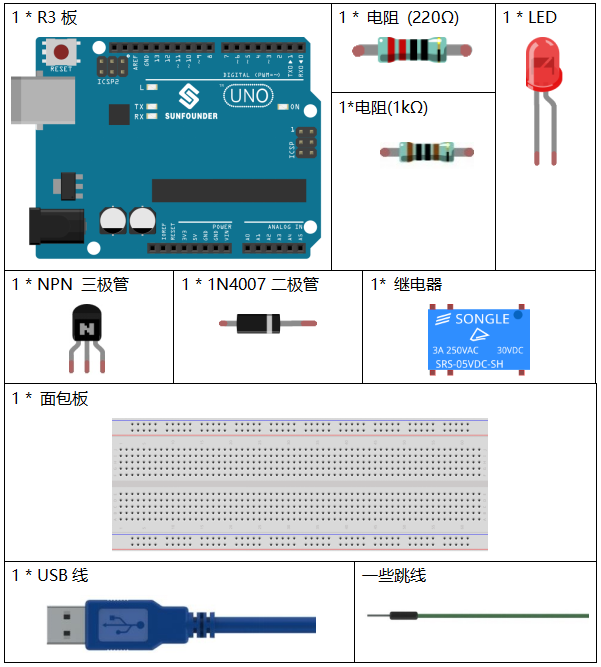
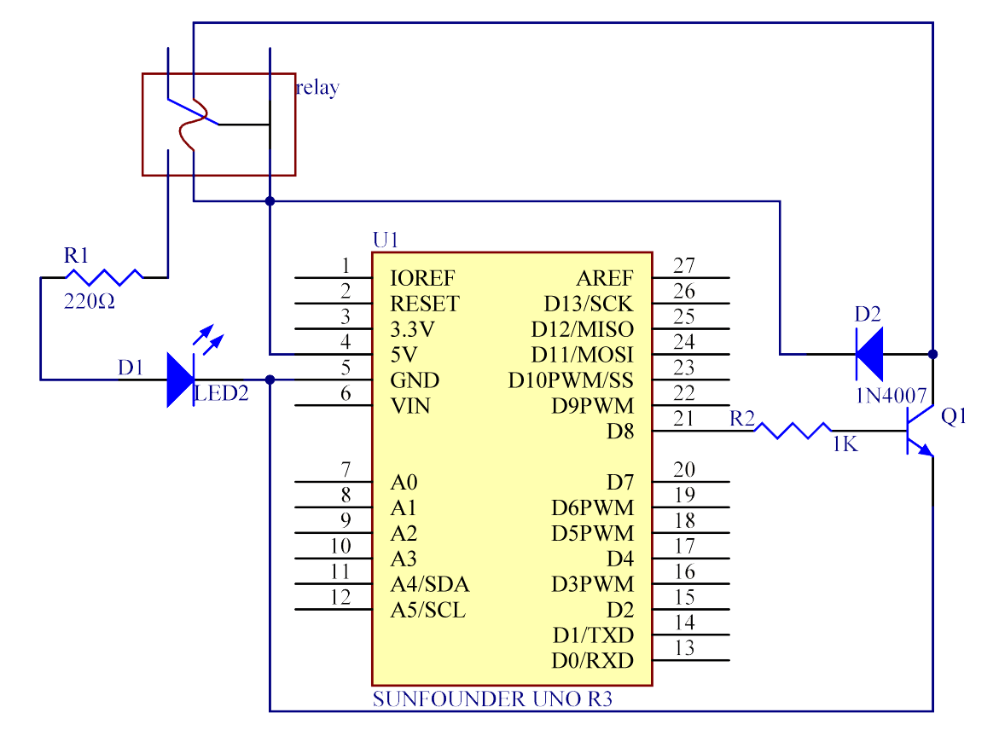
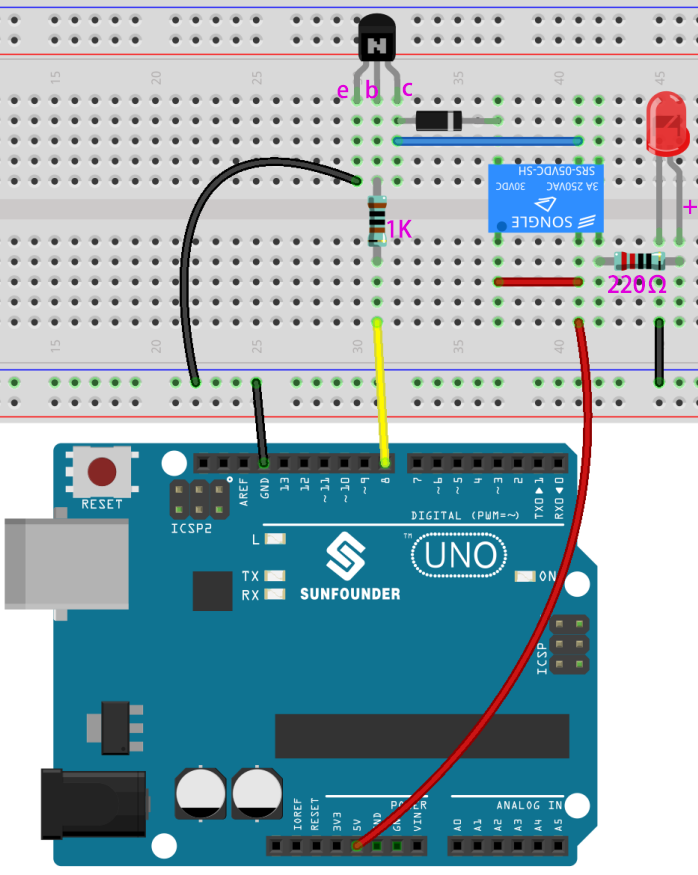
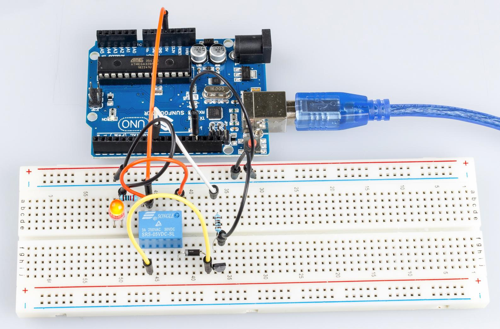

.. _relay_uno:

第 6 课 继电器
====================

介绍
--------------

我们可能知道，继电器是一种设备，用于响应所施加的输入信号在两个或多个点或设备之间提供连接。换句话说，继电器在控制器和设备之间提供隔离，因为设备可以在交流电和直流电下工作。然而，它们从工作于直流的微控制器接收信号，因此需要继电器来弥补差距。当你需要用小电信号控制大量电流或电压时，继电器非常有用。

所需器件
----------------

* :ref:`SunFounder R3板`
* :ref:`面包板`
* :ref:`跳线`
* :ref:`电阻`
* :ref:`继电器`
* :ref:`三极管`
* :ref:`二极管`
* :ref:`LED发光二极管`

原理图
-----------------------

将1K电阻（晶体管通电时限流）连接到控制板的第8脚，然后连接到NPN晶体管，其集电极连接到继电器的线圈和发射极到GND；将继电器的常开触点连接到 LED，然后连接到 GND。因此，当高电平信号提供给引脚 8 时，晶体管被激励，从而使继电器的线圈导通。然后它的常开触点闭合，LED 将亮起。当引脚 8 处于低电平时，LED 将熄灭。

原理图如下所示：

**整流二极管的作用**

当电压输入由High（5V）变为Low（0V）时，晶体管由饱和（放大、饱和、截止三种工作状态）变为截止，
线圈中的电流突然无法流过。此时，如果没有整流二极管，线圈两端会产生反电动势（EMF），底部为正极，顶部为负极，电压高于100V。这个电压加上来自晶体管电源的电压大到足以烧毁它。因此，整流二极管在将这个反电动势按上图箭头方向放电时极为重要，因此晶体管对GND的电压不高于+5V（+0.7V）。

在本实验中，当继电器闭合时，LED 会亮起；当继电器打开时，LED 将熄灭。

实验步骤
-----------------------------

**第 1 步**：搭建电路。

**第 2 步**：打开代码文件 ``Lesson_6_Relay.ino``。

**第 3 步**：选择 **开发板** 和 **端口**。

**第 4 步**：点击 **上传** 按钮来上传代码。

现在，发送一个高电平信号，继电器将关闭，LED 将亮起；发送一个低电平，它将打开并且 LED 将熄灭。此外，你还可以听到断开常闭触点并关闭常开触点引起的滴答声。

代码
--------

.. raw:: html

   <iframe src=https://create.arduino.cc/editor/sunfounder01/581e0c6c-c268-4cfe-aedf-5de80eb61315/preview?embed style="height:510px;width:100%;margin:10px 0" frameborder=0></iframe>

代码分析
-----------------

.. code-block:: arduino

    void loop()
    {
        digitalWrite(relayPin, HIGH); //drive relay closure conduction
        delay(1000); //wait for a second
        digitalWrite(relayPin, LOW); //drive the relay is closed off
        delay(1000); //wait for a second
    }

本实验中的代码很简单。首先，将 ``relayPin`` 设置为 ``HIGH`` 电平，连接到继电器的LED 将亮起。然后将 ``relayPin`` 设置为低电平，LED 熄灭。

