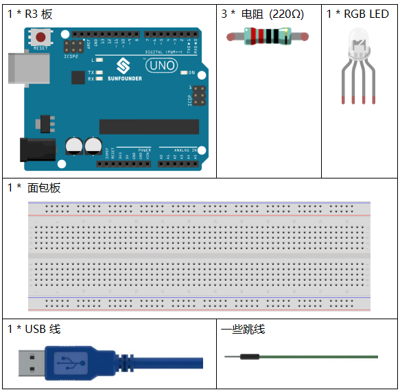
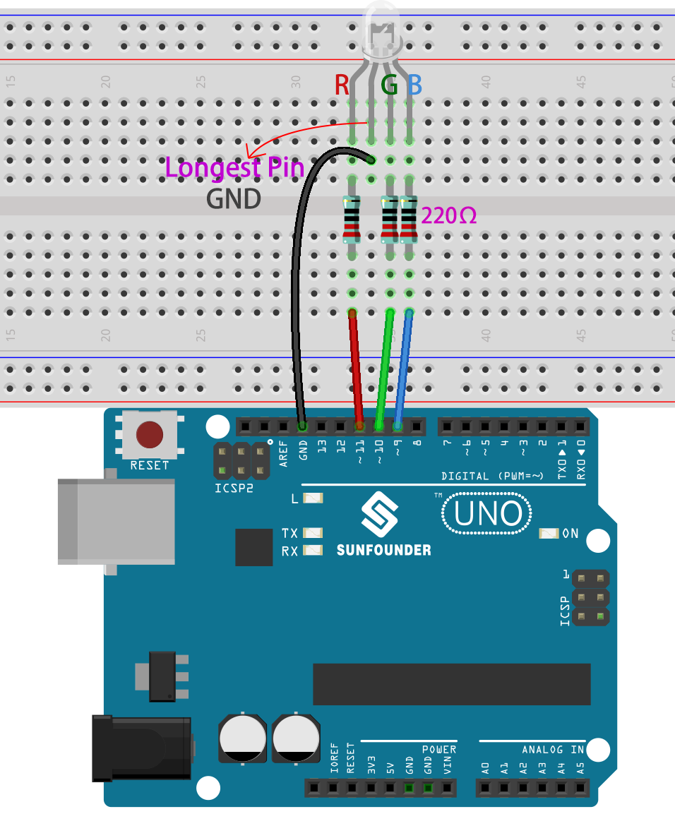
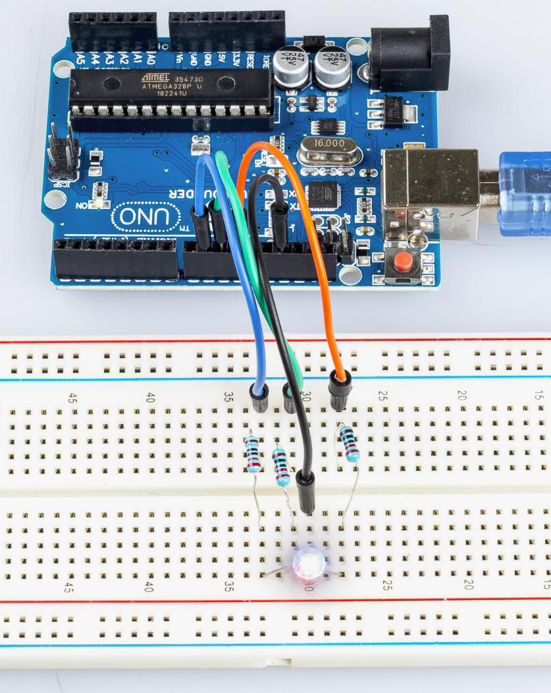

.. _rgb_uno:

第 7 课 RGB LED
==================

介绍
----------------

以前我们使用数字引脚来控制 LED 的亮度和亮度。在本课中，我们将使用 PWM 来控制 RGB LED 闪烁各种颜色。当 LED 的 R、G、B 引脚设置不同的 PWM 值时，其亮度会有所不同。当三种不同的颜色混合时，我们可以看到RGB LED闪烁不同的颜色。

所需器件
-----------------

* :ref:`SunFounder R3板`
* :ref:`面包板`
* :ref:`跳线`
* :ref:`电阻`
* :ref:`RGB LED`

PWM
--------

脉宽调制或 PWM 是一种通过数字方式获得模拟结果的技术。数字控制用于创建方波，这是一种在开和关之间切换的信号。这种开关模式可以通过改变信号打开的时间部分与信号关闭的时间来模拟完全打开（5 伏）和关闭（0 伏）之间的电压。“导通时间”的持续时间称为脉冲宽度。要获得不同的模拟值，你可以更改或调制该宽度。如果你使用某些设备（例如 LED）足够快地重复这种开关模式，它会是这样的：信号是 0 到 5V 之间的稳定电压，用于控制 LED 的亮度。

在下图中，绿线代表一个固定的时间段。该持续时间或周期是 PWM 频率的倒数。换句话说，当 Arduino 的 PWM 频率约为 500Hz 时，每条绿线的测量值为 2 毫秒。

.. image:: media_uno/image91.jpeg
   :align: center

对 `analogWrite() <https://www.arduino.cc/en/Reference/AnalogWrite>`_ 的调用范围为0 - 255，这样 ``analogWrite(255)`` 需要一个100% 占空比（始终打开）， ``analogWrite(127)`` 是50% 占空比（一半时间)。

你会发现PWM值越小，转换成电压后的值越小。然后 LED 相应地变暗。因此，我们可以通过控制PWM值来控制LED的亮度。

原理图
------------------------

在R3板上，3，5，6和9~11是PWM引脚，通过 ``analogWrite()`` 函数提供8位PWM输出。你可以连接这些引脚中的任何一个。这里我们将 0 到 255 之间的值输入到 RGB LED 的三个引脚，使其显示不同的颜色。R、G、B引脚接限流电阻后，分别接9、10、11脚。LED 最长的引脚（GND）连接到控制板的 GND。当三个引脚被赋予不同的 PWM 值时，RGB LED 将显示不同的颜色。

原理图如下所示：

.. image:: media_uno/image96.png
   :align: center

实验步骤
------------------------------

**第 1 步**：搭建电路。.

**第 2 步**：打开代码文件 ``Lesson_7_RGB_LED.ino``。

**第 3 步**：选择 **开发板** 和 **端口**。

**第 4 步**：点击 **上传** 按钮来上传代码。

在这里你应该看到 RGB LED 首先循环闪烁红色、绿色和蓝色，然后是红色、橙色、黄色、绿色、蓝色、靛蓝色和紫色。

代码
-------

.. raw:: html

   <iframe src=https://create.arduino.cc/editor/sunfounder01/5e26ed06-9ea8-42a8-9901-6d3c2f0efe9d/preview?embed style="height:510px;width:100%;margin:10px 0" frameborder=0></iframe>

代码分析
--------------------

**设置颜色**

这里使用 ``color()`` 函数来设置 RGB LED 的颜色。在代码中，它被设置为闪烁 7 种不同的颜色。

你可以使用计算机上的绘图工具获取 RGB 值。

1. 打开计算机上的绘画工具，然后单击编辑颜色。

.. image:: media_uno/image99.png
   :align: center

2. 选择一种颜色，即可看到该颜色的RGB值。在代码中填写它们。

.. image:: media_uno/image100.png
   :align: center

.. code-block:: arduino

    void loop()  // run over and over again  
    {    
        // Basic colors:  
        color(255, 0, 0); // turn the RGB LED red 
        delay(1000); // delay for 1 second  
        color(0,255, 0); // turn the RGB LED green  
        delay(1000); // delay for 1 second  
        color(0, 0, 255); // turn the RGB LED blue  
        delay(1000); // delay for 1 second 
        // Example blended colors:  
        color(255,0,252); // turn the RGB LED red  
        delay(1000); // delay for 1 second  
        color(237,109,0); // turn the RGB LED orange  
        delay(1000); // delay for 1 second  
        color(255,215,0); // turn the RGB LED yellow  
        delay(1000); // delay for 1 second  
        color(34,139,34); // turn the RGB LED green  
        delay(1000); // delay for 1 second 
        color(0,112,255); // turn the RGB LED blue  
        delay(1000); // delay for 1 second
        color(0,46,90); // turn the RGB LED  indigo 
        delay(1000); // delay for 1 second
        color(128,0,128); // turn the RGB LED purple  
        delay(1000); // delay for 1 second
    }

**color()函数**

.. code-block:: arduino

    void color (unsigned char red, unsigned char green, unsigned char blue)// the color generating function  
    {    
        analogWrite(redPin, red);   
        analogWrite(greenPin, green); 
        analogWrite(bluePin, blue); 
    }

定义三个无符号字符变量，红色、绿色和蓝色。将它们的值写入 ``redPin``、 ``greenPin`` 和 ``bluePin``。例如，颜色（128,0,128）是写128到redPin，0至greenPin和128至 bluePin。然后结果是 LED 闪烁紫色。

* ``analogWrite()``：将模拟值（PWM 波）写入引脚。它与模拟引脚无关，仅适用于 PWM 引脚。在调用 ``analogWrite()`` 之前，你不需要调用 ``pinMode()`` 将引脚设置为输出 。