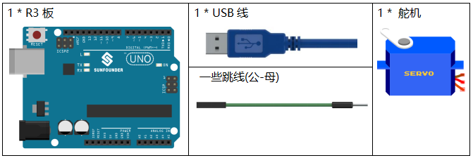
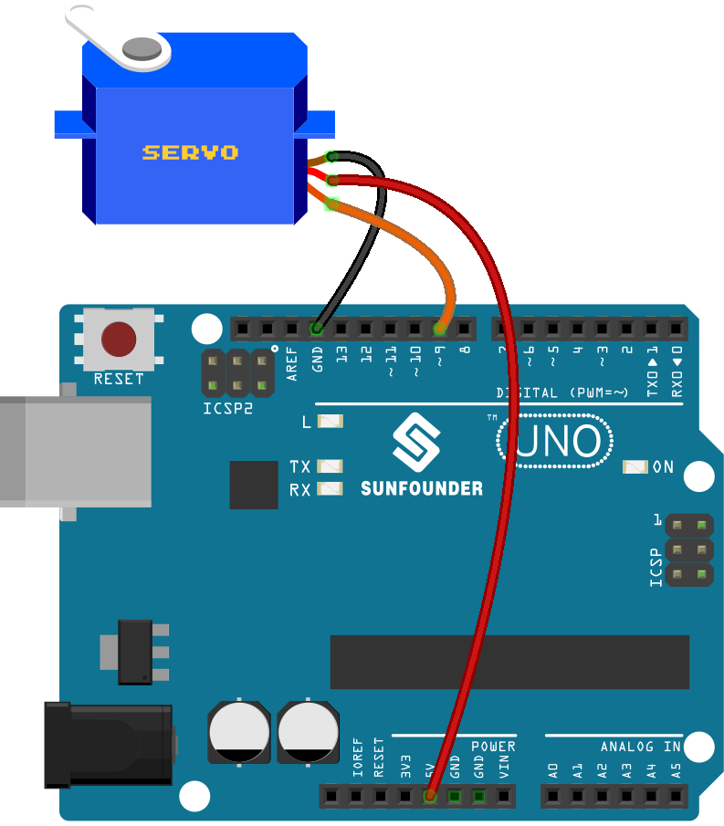
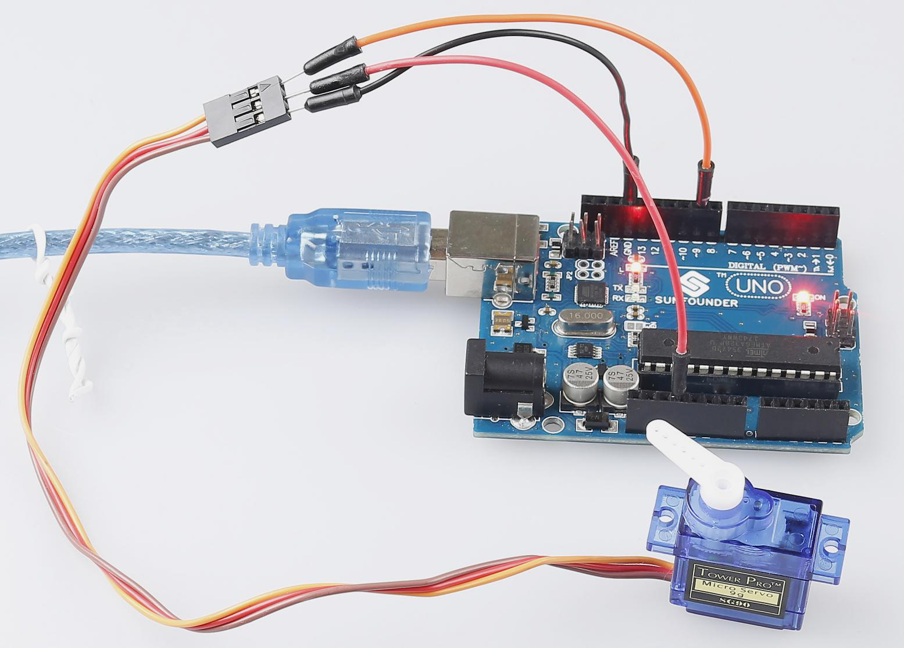

.. _servo_uno:

第 10 课 舵机
==================

介绍
-----------------

伺服是一种只能旋转180度的减速电机。它是通过从你的电路板发送电脉冲来控制的。这些脉冲告诉伺服它应该移动到什么位置。

舵机有三根线：棕色线为GND，红色线为VCC，橙色线为信号线。

所需器件
-----------------------

* :ref:`SunFounder R3板`
* :ref:`面包板`
* :ref:`跳线`
* :ref:`舵机`

原理图
---------------------

原理图如下所示：

.. image:: media_uno/image119.png

实验步骤
---------------------------

**第 1 步**：搭建电路。 (棕色连接到GND，橙色连接到9引脚，红色连接到5V)。

**第 2 步**：打开代码文件 ``Lesson_10_Servo.ino``。

**第 3 步**：选择 **开发板** 和 **端口**。

**第 4 步**：点击 **上传** 按钮来上传代码。

现在，你可以看到舵机的摇臂旋转并停止在 90 度（每次 15 度）。然后它向相反的方向旋转。

代码
--------

.. raw:: html

    <iframe src=https://create.arduino.cc/editor/sunfounder01/cb89379d-79ca-4f99-919b-baba70801949/preview?embed style="height:510px;width:100%;margin:10px 0" frameborder=0></iframe>

代码分析
-------------------

**添加一个库**

.. code-block:: Arduino

    #include <Servo.h>
    Servo myservo; //create servo object to control a servo

导入 ``Servo.h`` 文件之后，你就可以在这个文件中的函数。 ``Servo`` 是 Arduino IDE 中的内置库。你可以在安装路径， 默认是 ``C:Program FilesArduinolibraries`` 下找到 ``Servo`` 文件夹。

**初始化舵机**

.. code-block:: Arduino

    void setup()
    {
        myservo.attach(9); //attachs the servo on pin 9 to servo object
        myservo.write(0); //back to 0 degrees
        delay(1000); //wait for a second
    }

* ``myservo.attach()``：用来初始化舵机，并设置它的信号引脚。

* ``myservo.write()``：将一个值写入舵机，相应地控制它的轴。在一个标准的舵机上，这将设置轴的角度(度），将轴移到那个方向。这里让伺服机首先保持在0角度。

**让舵机转动**

.. code-block:: Arduino

    void loop()
    {
        for (int i = 0; i <= 180; i++)
        {
            myservo.write(i); //write the i angle to the servo
            delay(15); //delay 15ms
        }
        for (int i = 180; i >= 0; i--)
        {
            myservo.write(i); //write the i angle to the servo
            delay(15); //delay 15ms
        }
    }

用2个 ``for()`` 语句将0-180写入舵机，这样就可以看到舵机从0转到180角，然后转回0。

