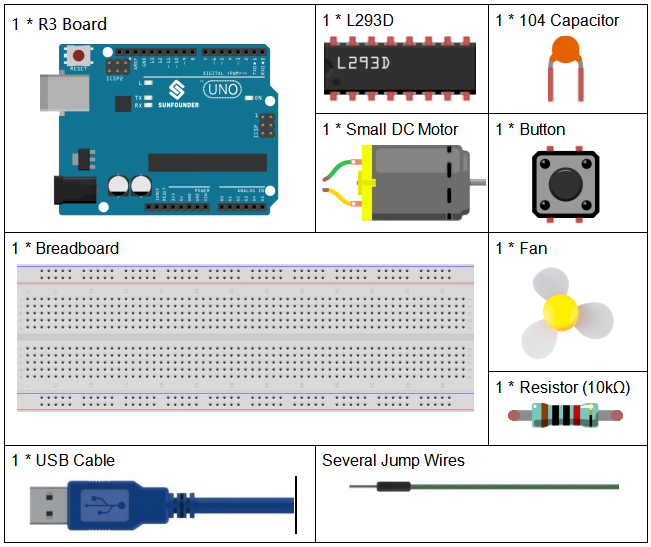
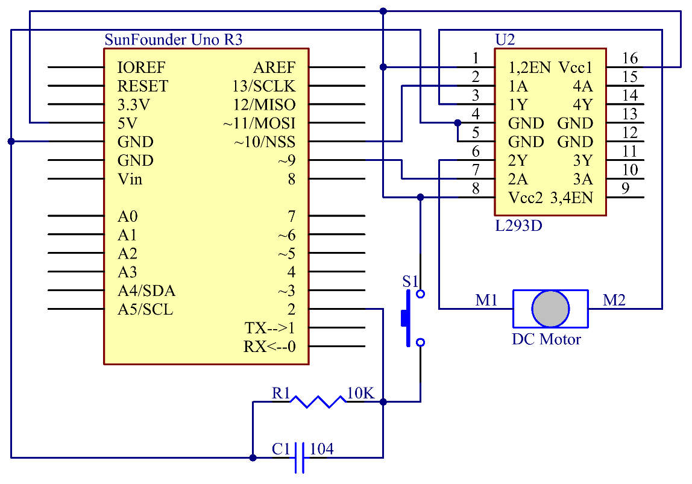
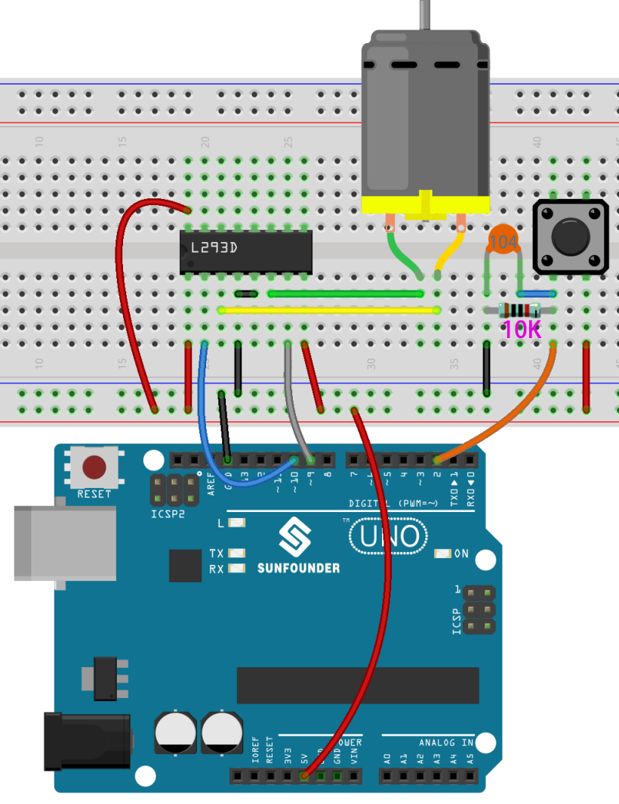
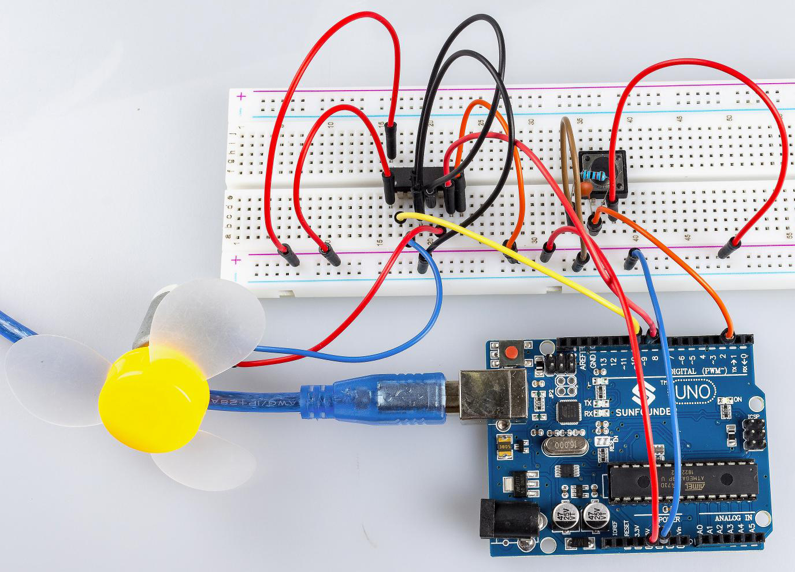

Lesson 22 Simple Creation-Small Fan
========================================

Introduction
-------------------

In this experiment, we will learn how to control the direction and speed
of a small-sized DC motor by a driver chip L293D. Making simple
experiments, we will just make the motor rotate left and right, and
accelerate or decelerate automatically.

Components
----------------

Component Introduction
-------------------------------

The maximum current of an Arduino I/O port is 20mA but the drive current
of a motor is at least 70mA. Therefore, we cannot directly use the I/O
port to drive the current; instead, we can use an L293D to drive the
motor.

L293D
^^^^^^^^^^^^

L293D is designed to provide bidirectional drive currents of up to 600mA
at voltages from 4.5V to 36V. It's used to drive inductive loads such as
relays, solenoids, DC and bipolar stepping motors, as well as other
high-current/high-voltage loads in positive-supply applications.

See the figure of pins below. L293D has two pins (Vcc1 and Vcc2) for
power supply. Vcc2 is used to supply power for the motor, while Vcc1,
for the chip. Since a small-sized DC motor is used here, connect both
pins to +5V. If you use a higher power motor, you need to connect Vcc2
to an external power supply. 

.. image:: media_uno/image189.png
   :alt: IMG_256
   :width: 4.81736in
   :height: 2.36389in
   :align: center

Pin EN is an enabling pin and works with High level. A stands for input
and Y for output. When pin EN is High level, if A is High, Y outputs
High level; if A is Low, Y outputs Low level. When pin EN is Low level,
the L293D does not work. It just needs to drive one motor in this
experiment, so here use one side of the L293D.

**DC Motor**

.. image:: media_uno/image187.png
   :width: 3.6in
   :height: 1.6875in
   :align: center

This is a 5V DC motor. Give the two terminals of the copper sheet one
high and one low level, and the motor will rotate. For convenient
purposes, you can weld the pins to it.

Size: 25*20*15MM                       
                           Free-run speed (3V): 13000RPM 

Stall current (3V): 800 mA                                  
Shaft diameter: 2 mm

Operation Voltage: 1-6V                                     
Free-run current (3V): 70 mA 

Schematic Diagram
-----------------------------

The Enable pin 1,2EN of the L293D are connected to 5V already, so L293D
is always in the working state. Connect pin 1A and 2A to pin 9 and 10 of
the control board respectively. The two pins of the motor are connected
to pin 1Y and 2Y respectively. When pin 10 is set as High level and pin
9 as Low, the motor will start to rotate towards one direction. When the
pin 10 is Low and pin 9 is High, it rotates in the opposite direction.

Experimental Procedures
---------------------------

**Step 1:** Build the circuit.

**Step 2:** Open the code file.

**Step 3:** Select the **Board** and **Port.**

**Step 4:** Upload the sketch to the board.

The blade of the DC motor will begin rotating left and right, in a speed
that varies accordingly.

Code
--------

.. raw:: html

   <iframe src=https://create.arduino.cc/editor/sunfounder01/d63a8af3-d1fe-4147-8333-fbf6c0bb6486/preview?embed style="height:510px;width:100%;margin:10px 0" frameborder=0></iframe>

Code Analysis
--------------------

**Code Analysis** **24-1** **Workflow of the Small Fan**

.. code-block:: arduino

    void loop() {

      // read the state of the switch into a local variable:

      int reading = digitalRead(buttonPin);

      if (reading != lastButtonState)// If the button state is different from last time

      {

         lastDebounceTime = millis();// reset the debouncing timer

      }

      if ((millis() - lastDebounceTime) > debounceDelay) 
      /* Determine whether the button has been pressed 
      for over 50ms to prevent signal generated due to accidental touch.*/

      {

         if (reading != buttonState) 
         /*If it’s over 50ms and *reading* does not equal to *buttonState*, 
         it indicates the button state has changed.*/

         {

            buttonState = reading; // Store the state of button in buttonState

            if (buttonState == HIGH) 
            //If buttonState is high level, it means the button has been pressed.

            {

               digitalWrite(ledPin, HIGH); //turn on the LED

               stat = stat + 1;

               if(stat >= 4)// When stat>=4, set it as 0.

               {

                  stat = 0;

               }

            }

            else /*else, turn off the LED. When you press the button, the LED will
            light up and it goes out when you release the button.*/

               digitalWrite(ledPin, LOW);

         }

      }

      // The rotational speed is different when the button is pressed at different times.

      switch(stat)

      {

      case 1:

         clockwise(rank1);// When stat=1, set the rotate speed of the motor as rank1=150

         break;

      case 2:

         clockwise(rank2);// When stat=2, set the rotate speed of the motor as rank1=200

         break;

      case 3:

         clockwise(rank3);// When stat=3, set the rotate speed of the motor as rank1=250

         break;

      default:

         clockwise(0);

      }

      // save the reading. Next time through the loop,

      // it'll be the lastButtonState:

      lastButtonState = reading;

   }
   
**Code Analysis** **24-2** **clockwise() function**

.. code-block:: arduino

    void clockwise(int Speed)

    {

      analogWrite(motorIn1,0);

      analogWrite(motorIn2,Speed);

    }

This function is to set the rotational speed of the *motor*: write
*Speed* to pin 9 and 0 to pin 10. The motor rotates towards a certain
direction and the speed is the value of **Speed**.

Experiment Summary
-----------------------

In this experiment, you can also control the motor to rotate or not.
Just connect pin 1, 2EN of the L293D to an I/O port of the control
board. Set 1, 2EN as High level, and the motor will start rotating; set
it as Low level, it will stop the rotating.