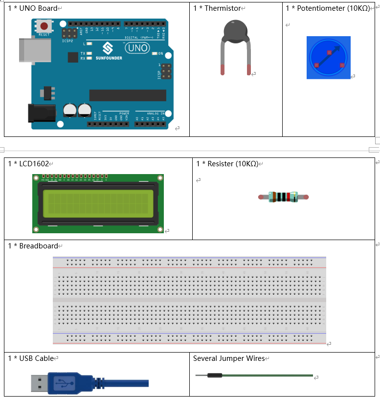
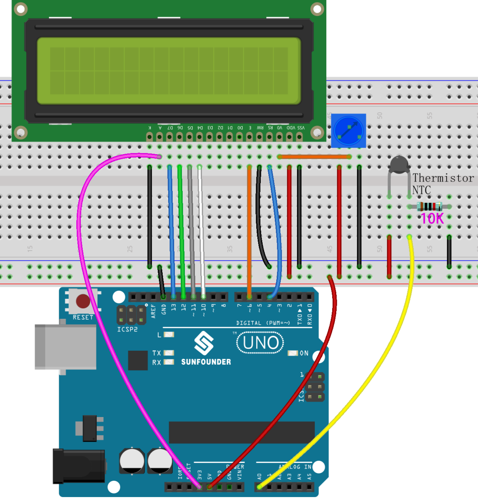
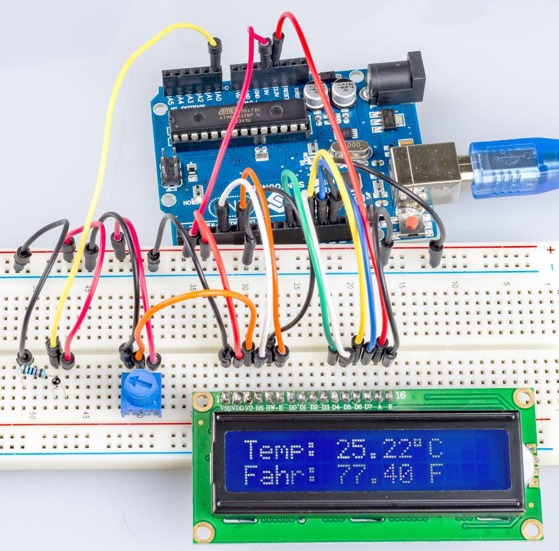

.. _thermistor_uno:

第 12 课 热敏电阻
====================

介绍
-----------------

到目前为止，我们已经学习了很多设备。要做更多的东西，你需要掌握更多的知识。今天我们要认识一个热敏电阻。它类似于光敏电阻，能够根据外部变化来改变其电阻。与光敏电阻不同，热敏电阻的电阻值随外部环境温度的变化而显着变化。

所需器件
-------------------

* :ref:`SunFounder R3板`
* :ref:`面包板`
* :ref:`跳线`
* :ref:`电阻`
* :ref:`电位器`
* :ref:`热敏电阻`
* :ref:`LCD1602液晶显示屏`

原理图
------------------------

热敏电阻是一种敏感元件，它有两种类型：负温度系数（NTC）和正温度系数（PTC），也有NTC和PTC。其电阻随温度显着变化。当NTC的电阻降低时，PTC热敏电阻的电阻随着温度的升高而增加。

在这个实验中，我们使用一个 NTC。

原理图如下所示：

.. image:: media_uno/image128.png

其原理是NTC热敏电阻的阻值随着外界环境的温差而变化。它检测环境的实时温度。当温度升高时，热​​敏电阻的阻值减小，A0 脚电压相应升高。然后电压数据由 A/D 适配器转换为数字量。然后通过编程输出摄氏和华氏温度，然后显示在 LCD1602 上。

在这个实验中，使用了一个热敏电阻和一个 10k 的上拉电阻。每个热敏电阻都有一个正常的电阻。这里是 10k ohm，这是在 25 摄氏度下测量的。

这是电阻和温度变化之间的关系：

    R T  = R N  exp B(1/TK – 1/TN)

* ``RT`` 是 NTC 热敏电阻在温度为 TK时的阻值。
* ``RN`` 是NTC 热敏电阻在额定温度为TN的阻值。
* ``TK`` 是开尔文温度，单位是 K。
* ``TN`` 是额定开尔文温度；单位也是K。
* 并且 ``β``，这里是 NTC 热敏电阻的材料常数，也称为热敏指数。
* ``exp`` 是指数的缩写，是一个以 e 为基数的指数，它是一个自然数，大约等于 2.7。

请注意，此关系是一个经验公式。只有当温度和电阻在有效范围内时才准确。

由于 TK = T+273，T 为摄氏温度，电阻与温度变化的关系可转化为：

    R =R o  exp B[1/(T+273) – 1/(To+273)]

B 是 beta 的缩写，是一个常数。这里是 4090。R o是 10k 欧姆，T o是 25 摄氏度。数据可以在热敏电阻的数据表中找到。同样，上述关系可以转化为一个来评估温度：

    T= B/[ ln(R/ 10) + (B/ 298) ] – 273（所以 ln 在这里表示自然对数，以 e 为底的对数）

如果我们使用固定电阻为 10k ohms 的电阻，我们可以用这个公式计算模拟输入引脚 A0 的电压：

    V =10k x 5/(R+10K)

所以，可以形成这种关系：

    R = (5 x 10k /V) - 10k

A0 的电压通过A/D 适配器转换成数字a。

    a=V x (1024/5)

    V=a/205

然后用表达式替换关系式R = (5 x 10k /V) - 10k 中的V，我们可以得到：R=1025 x 10k/a-10k。

最后将这里的公式中的R代入T= B/[ ln(R/ 10) + (B/ 298) ] – 273，就是刚刚形成的。然后我们最终得到温度的关系如下：

    T = B/[ ln{[ 1025 X 10/a) - 10]/10} 十(B/298)] – 273

实验步骤
------------------------------

**第 1 步**：搭建电路。

**第 2 步**：打开代码文件 ``Lesson_12_Thermistor.ino``。

**第 3 步**：选择 **开发板** 和 **端口**。

**第 4 步**：点击 **上传** 按钮来上传代码。

现在你可以在LCD1602上显示在摄氏度和华氏度下的温度。

代码
-----------

.. raw:: html

   <iframe src=https://create.arduino.cc/editor/sunfounder01/7f258b51-f268-492c-92a5-a0da55dca17a/preview?embed style="height:510px;width:100%;margin:10px 0" frameborder=0></iframe> 

代码分析
-------------------

**设置变量**

.. code-block:: arduino

    #define analogPin A0 //the thermistor attach to
    #define beta 3950 //the beta of the thermistor
    #define resistance 10 //the value of the pull-up resistor

设置β系数的值，在热敏电阻的数据表中有描述。

**获取温度**

.. code-block:: arduino

    void loop()
    {
        //read thermistor value
        long a = analogRead(analogPin);
        //the calculating formula of temperature
        float tempC = beta / (log((1025.0 * 10 / a - 10) / 10) + beta / 298.0) - 273.0;
        float tempF = 1.8 * tempC + 32.0;

读取A0的值（热敏电阻），然后通过公式计算出摄氏温度，再通过公式将摄氏温度转换为华氏温度。

**在LCD1602上显示温度**

.. code-block:: Arduino

        lcd.setCursor(0, 0); // set the cursor to column 0, line 0
        lcd.print("Temp: ");// Print a message of "Temp: "to the LCD.
        // Print a centigrade temperature to the LCD.
        lcd.print(tempC);
        // Print the unit of the centigrade temperature to the LCD.
        lcd.print(char(223));//print the unit" ℃ "
        lcd.print("C");
        // (note: line 1 is the second row, since counting begins with 0):
        lcd.setCursor(0, 1); // set the cursor to column 0, line 1
        lcd.print("Fahr: ");
        lcd.print(tempF);// Print a Fahrenheit temperature to the LCD.
        lcd.print(" F"); // Print the unit of the Fahrenheit temperature to the LCD.
        delay(200); //wait for 100 milliseconds
    }

