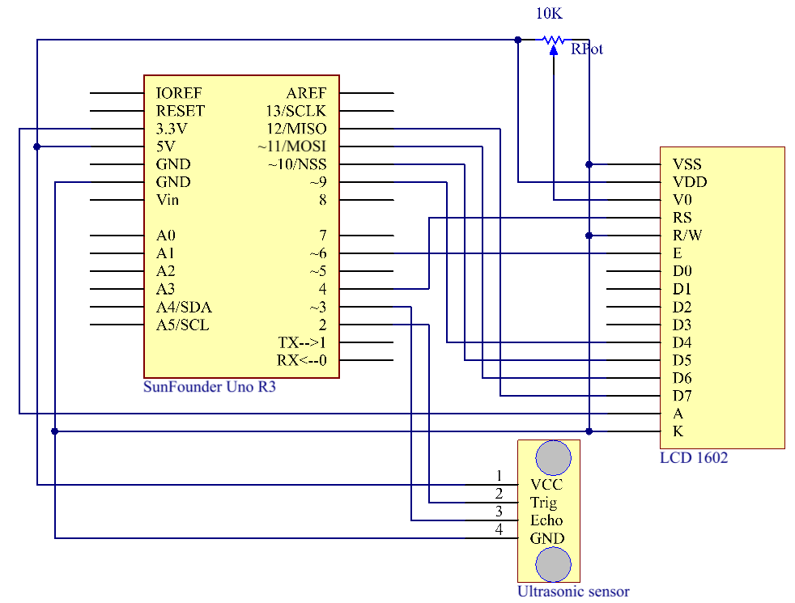

.. _ultrasonic_uno:

Lesson 13 Ultrasonic
==========================

Introduction
--------------------

When you are reversing, you will see the distance between the car and
the surrounding obstacles to avoid collision. The device for detecting
the distance is an ultrasonic sensor. In this experiment, you will learn
how the ultrasonic wave detects the distance.

Components
-----------------

.. image:: img/uno17.png
    :align: center

* :ref:`SunFounder R3 Board`
* :ref:`Breadboard`
* :ref:`Jumper Wires`
* :ref:`Potentiometer`
* :ref:`Ultrasonic Module`
* :ref:`LCD1602`

Schematic Diagram
--------------------------

Experimental Procedures
---------------------------

**Step 1**: Build the circuit.

.. image:: img/image135.png
   :align: center

**Step 2:** Open the code file.

**Step 3:** Select the **Board** and **Port.**

**Step 4:** Upload the sketch to the board.

Now, if you use a piece of paper to approach or keep it far away from the sensor. You will see the value displayed on the LCD changes, which indicates the distance between the paper and the ultrasonic sensor.

.. image:: img/image137.jpeg
   :align: center

Code
--------

.. raw:: html

   <iframe src=https://create.arduino.cc/editor/sunfounder01/b8d4bd61-7583-4631-a270-b7968f1e2f88/preview?embed style="height:510px;width:100%;margin:10px 0" frameborder=0></iframe>

Code Analysis
------------------------

**1. Initialize the ultrasonic sensor and LCD1602**

.. code-block:: arduino

    #include <LiquidCrystal.h>

    LiquidCrystal lcd(4, 6, 10, 11, 12, 13);  //lcd(RS,E,D4,D5,D6,D7)

    const int trigPin = 2;  //  trig pin on the ultrasonic sensor attach to pin2 .
    const int echoPin = 3;  //  echo pin on the ultrasonic sensor attach to pin3.

    void setup() {
    lcd.begin(16, 2);  // set the position of the characters on the LCD as Line 2, Column 16
    Serial.begin(9600);
    pinMode(echoPin, INPUT);
    pinMode(trigPin, OUTPUT);
    }

**2. Display the distance on the LCD1602**

.. code-block:: arduino

    void loop() {
        float distance = readSensorData();
        //Serial.println(distance); //Print the distance on the serial monitor
        lcd.setCursor(0, 0);         //Place the cursor at Line 1, Column 1. From here the characters are to be displayed
        lcd.print("Distance:");      ////Print Distance: on the LCD
        lcd.setCursor(0, 1);         //Set the cursor at Line 1, Column 0
        lcd.print("             ");  //Here is to leave some spaces after the characters so as to clear the previous characters that may still remain.
        lcd.setCursor(9, 1);         //Set the cursor at Line 1, Column 9.
        lcd.print(distance);         // print on the LCD the value of the distance converted from the time between ping sending and receiving.
        lcd.setCursor(12, 1);        //Set the cursor at Line 1, Column 12.
        lcd.print("cm");             //print the unit "cm"
    }

**3. Convert the time to distance**

    .. code-block:: arduino

        float readSensorData(){// ...}

    PING is triggered by a HIGH pulse of 2 or more microseconds. (Give a
    short LOW pulse beforehand to ensure a clean HIGH pulse.)

    .. code-block:: arduino

        digitalWrite(trigPin, LOW); 
        delayMicroseconds(2);
        digitalWrite(trigPin, HIGH); 
        delayMicroseconds(10);
        digitalWrite(trigPin, LOW); 

    The echo pin is used to read signal from PING, a HIGH pulse whose
    duration is the time (in microseconds) from the sending of the ping to
    the reception of echo of the object.

    .. code-block:: arduino

        microsecond=pulseIn(echoPin, HIGH);

    The speed of sound is 340 m/s or 29 microseconds per centimeter.

    This gives the distance travelled by the ping, outbound and return, so
    we divide by 2 to get the distance of the obstacle.

    .. code-block:: arduino

        float distance = microsecond / 29.00 / 2;  