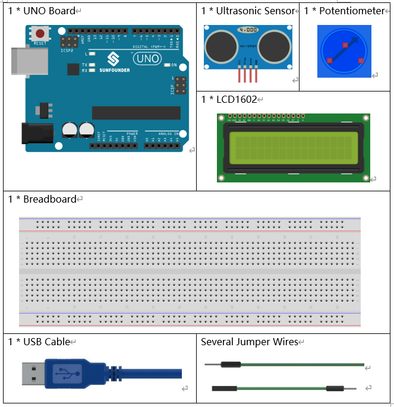
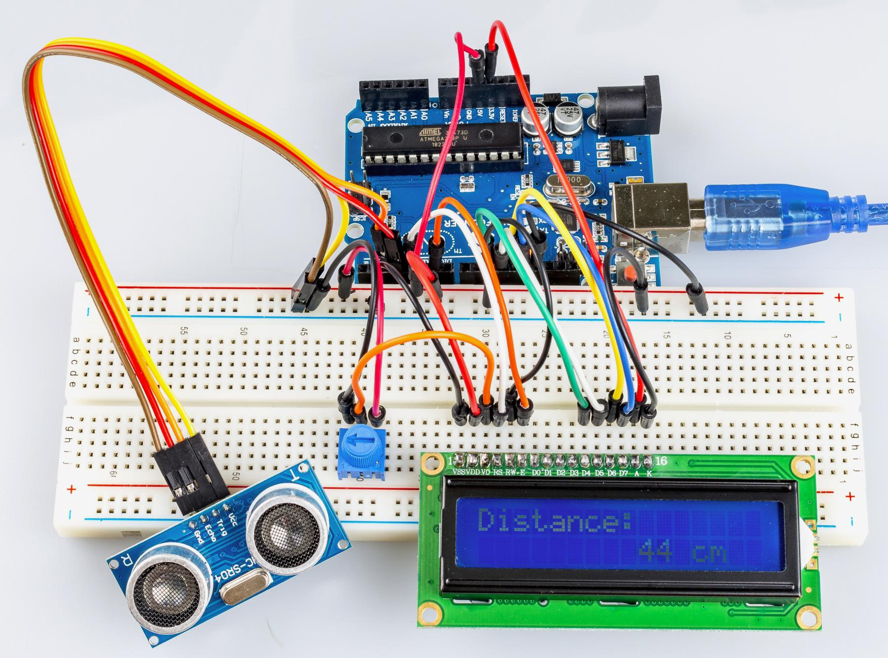

.. _ultrasonic_uno:

Lesson 13 Ultrasonic
==========================

Introduction
--------------------

When you are reversing, you will see the distance between the car and
the surrounding obstacles to avoid collision. The device for detecting
the distance is an ultrasonic sensor. In this experiment, you will learn
how the ultrasonic wave detects the distance.

Components
-----------------

* :ref:`SunFounder R3 Board`
* :ref:`Breadboard`
* :ref:`Jumper Wires`
* :ref:`Potentiometer`
* :ref:`Ultrasonic Module`
* :ref:`LCD1602`

Schematic Diagram
--------------------------

.. image:: media_uno/image134.png

Experimental Procedures
---------------------------

**Step 1**: Build the circuit.

.. image:: media_uno/image135.png
   :align: center

**Step 2:** Open the code file.

**Step 3:** Select the **Board** and **Port.**

**Step 4:** Upload the sketch to the board.

.. Note::
    If you receive the following error, it is because you didn’t add a
    library named NewPing, please refer to :ref:`Add Libraries`.

    .. image:: media_uno/image136.png

Now, if you use a piece of paper to approach or keep it far away from the sensor. You will see the value displayed on the LCD changes, which indicates the distance between the paper and the ultrasonic sensor.

Code
--------

.. raw:: html

   <iframe src=https://create.arduino.cc/editor/sunfounder01/b8d4bd61-7583-4631-a270-b7968f1e2f88/preview?embed style="height:510px;width:100%;margin:10px 0" frameborder=0></iframe>

Code Analysis
------------------------

**Initialize the ultrasonic sensor and LCD1602**

.. code-block:: arduino

    #include <LiquidCrystal.h> // use #include to define the header file.

    #include <NewPing.h> // use #include to define the header file.

    LiquidCrystal lcd(4, 6, 10, 11, 12, 13); //lcd(RS,E,D4,D5,D6,D7)

    #define TRIGGER_PIN 2 // trig pin on the ultrasonic sensor attach to pin2.

    #define ECHO_PIN 3 // echo pin on the ultrasonic sensor attach to pin3.

    #define MAX_DISTANCE 400 // Maximum distance we want to ping for (in centimeters). Maximum sensor distance is rated at 400-500cm.

    NewPing sonar(TRIGGER_PIN, ECHO_PIN, MAX_DISTANCE); // NewPing setup of pins and maximum distance.

Create a NewPing variable sonar. The basic format of NewPing is: NewPing
(uint8_t trigger_pin, uint8_t echo_pin, int max_cm_distance). Here uint means an unsigned integer and 8 means 8 bits. So a value in
the uint8 format here means an unsigned-char type value.

**Convert the time to distance**

.. code-block:: arduino

    unsigned int uS = sonar.ping(); // Send ping, get ping time in microseconds (uS).

``ping()`` is used to calculate the time sent from the pulse to the reception. Define a variable ``Us`` to store the received time, which should be in microseconds (us).

.. code-block:: arduino

    int distance = uS / US_ROUNDTRIP_CM;

**uS / US_ROUNDTRIP_CM** is a formula to convert the time between ping
sending and receiving into a distance. The unit is cm.

**Display the distance on the LCE1602**

.. code-block:: arduino

   lcd.setCursor(0, 0); //Place the cursor at Line 1, Column 1. From here the characters are to be displayed

   lcd.print("Distance:"); //Print Distance: on the LCD

   lcd.setCursor(0, 1); //Set the cursor at Line 1, Column 0

   lcd.print(" "); //Here is to leave some spaces after the characters so as to clear the previous characters that may still remain

   lcd.setCursor(9, 1); //Set the cursor at Line 1, Column 9

   lcd.print(distance); //print on the LCD the value of the distance converted from the time between ping sending and receiving

   lcd.setCursor(12, 1); //Set the cursor at Line 1, Column 12

   lcd.print("cm"); //print the unit "cm"